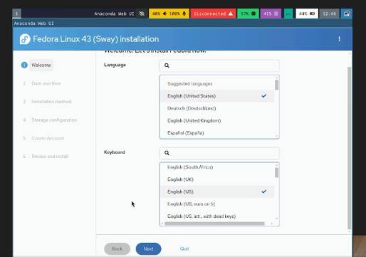
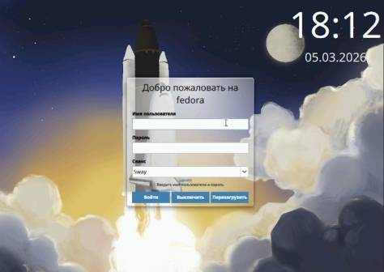
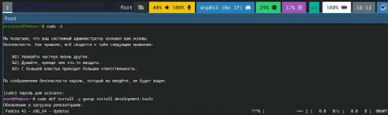
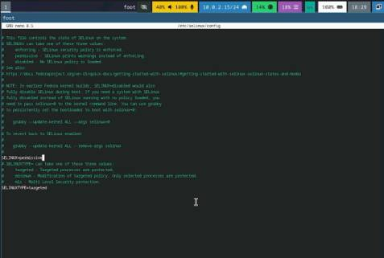
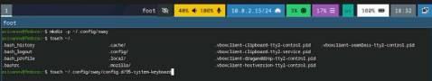
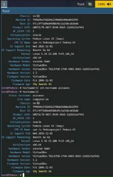
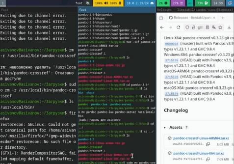
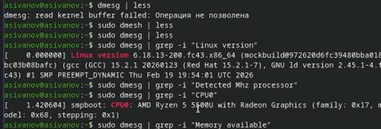
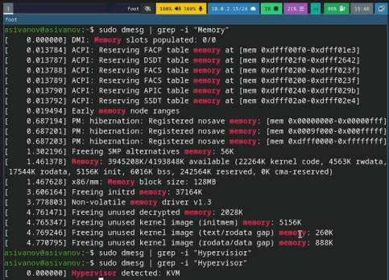

---
## Author
author:
  name: Левищева Анастасия Петровна
  degrees: DSc
  orcid: 0000-0002-0877-7063
  email: 1032252643@rudn.ru
  affiliation:
    - name: Российский университет дружбы народов
      country: Российская Федерация
      postal-code: 117198
      city: Москва
      address: ул. Миклухо-Маклая, д. 6
## Title
title: Лабораторная работа № 1
subtitle: Архитектура компьютеров и операционные системы
license: Левищева Анастасия Петровна
date: today
date-format: "2026-03-07" # Example: 2025-09-06
---

# Информация

## Докладчик

:::::::::::::: {.columns align=center}
::: {.column width="70%"}

  * Левищева Анастасия Петровна
  * group NKAbd-02-25
  * Российский университет дружбы народов им. П. Лумумбы
  * [1032252643@rudn.ru]

:::
::::::::::::::

# Цель работы

Целью данной работы является приобретение практических навыков установки операционной системы на виртуальную машину, настройки минимально необходимых для дальнейшей работы сервисов.

# Задание

    Дождитесь загрузки графического окружения и откройте терминал. В окне терминала проанализируйте последовательность загрузки системы, выполнив команду dmesg. Можно просто просмотреть вывод этой команды:

    dmesg | less

    Можно использовать поиск с помощью grep:

    dmesg | grep -i "то, что ищем"

    Получите следующую информацию.
        Версия ядра Linux (Linux version).
        Частота процессора (Detected Mhz processor).
        Модель процессора (CPU0).
        Объём доступной оперативной памяти (Memory available).
        Тип обнаруженного гипервизора (Hypervisor detected).
        Тип файловой системы корневого раздела.
        Последовательность монтирования файловых систем.

# Выполнение лабораторной работы

## Устанавливаем виртуальную машину.

Папка виртуальных машин. Значения по умолчанию
Linux: $HOME/VirtualBox VMs.

## Установочный образ

Перенесем установочный образ в папку
/var/tmp/имя_пользователя/iso: 
mkdir -p "$(vboxmanage list systemproperties | grep 'Default machine folder:' | cut -d':' -f2 | tr -d ' ')/iso"

mv Fedora-Sway-Live-x86_64-39-1.5.iso "$(vboxmanage list systemproperties | grep 'Default machine folder:' | cut -d':' -f2 | tr -d ' ')/iso"

## Настройка хост-клавиши

Хост-клавишей по умолчанию является правый Ctrl.

По умолчанию в дисплейных классах на клавише правый Ctrl находится переключатель языка ввода.

Эти значения могут конфликтовать.

## Графический интерфейс

В меню выберите Файл, Настройки.

Выберите Ввод, вкладка Виртуальная машина.

Выберите Сочетание клавиш в строке Хост-комбинация.

Нажмите новое сочетание клавиш.

Нажмите ОК, чтобы сохранить изменения.

## Командная строка

Проверим текущую комбинацию для хост-клавиши:

VBoxManage getextradata global GUI/Input/HostKeyCombination

По умолчанию установлена комбинация 65508, соответствующая правой клавише Ctrl.

Установите нужную клавишу (в примере клавиша Menu):
VBoxManage setextradata global GUI/Input/HostKeyCombination 65383

### Создадим и запустим виртуальную машину. Запускаем установочный образ: ([рис. @fig-001]).

{#fig-001 width=70%}

### После установки: ([рис. @fig-002]).

{#fig-002 width=70%}

### Войдите в ОС под заданной вами при установке учётной записью.

Нажмите комбинацию Win+Enter для запуска терминала.

Переключитесь на роль супер-пользователя:
sudo -i

## Обновления

### Установите средства разработки:
sudo dnf -y group install development-tools ([рис. @fig-003]).

{#fig-003 width=70%}

### Обновить все пакеты
sudo dnf -y update

## Повышение комфорта работы

Программы для удобства работы в консоли:
sudo dnf -y install tmux mc

Другой вариант консоли:
sudo dnf -y install kitty

## Автоматическое обновление

При необходимости можно использовать автоматическое обновление.

Установка программного обеспечения:
sudo dnf -y install dnf-automatic

Задаёте необходимую конфигурацию в файле /etc/dnf/automatic.conf.

Запустите таймер:
sudo systemctl enable --now dnf-automatic.timer

## Отключение SELinux

В данном курсе мы не будем рассматривать работу с системой безопасности SELinux.

Поэтому отключим его.

### В файле /etc/selinux/config замените значение

SELINUX=enforcing

на значение

SELINUX=permissive ([рис. @fig-004]).

{#fig-004 width=70%}

### Перегрузите виртуальную машину:
sudo systemctl reboot

## Настройка раскладки клавиатуры

Войдите в ОС под заданной вами при установке учётной записью.

Нажмите комбинацию Win+Enter для запуска терминала.

Запустите терминальный мультиплексор tmux:
tmux

Создайте конфигурационный файл
~/.config/sway/config.d/95-system-keyboard-config.conf:
mkdir -p ~/.config/sway
touch ~/.config/sway/config.d/95-system-keyboard-config.conf

### Отредактируйте конфигурационный файл
~/.config/sway/config.d/95-system-keyboard-config.conf:
exec_always /usr/libexec/sway-systemd/locale1-xkb-config --oneshot ([рис. @fig-005]).

{#fig-005 width=70%}

### Переключитесь на роль супер-пользователя:
sudo -i

Отредактируйте конфигурационный файл /etc/X11/xorg.conf.d/00-keyboard.conf:
Section "InputClass"
	Identifier "system-keyboard"
	MatchIsKeyboard "on"
	Option "XkbLayout" "us,ru"
	Option "XkbVariant" ",winkeys"
	Option "XkbOptions" "grp:rctrl_toggle,compose:ralt,terminate:ctrl_alt_bksp"
EndSection

Для этого можно использовать файловый менеджер mc и его встроенный редактор.

Перегрузите виртуальную машину:
sudo systemctl reboot

## Установка имени пользователя и названия хоста

Если при установке виртуальной машины вы задали имяпользователя или имя хоста, не удовлетворяющее соглашению обименовании, то вам необходимо исправить это.

Запустите виртуальную машину и залогиньтесь.

Нажмите комбинацию Win+Enter для запуска терминала.

Запустите терминальный мультиплексор tmux:
tmux

Переключитесь на роль супер-пользователя:
sudo -i

Создайте пользователя (вместо username укажите ваш логин в дисплейном классе):
adduser -G wheel username

Задайте пароль для пользователя (вместо username укажите ваш логин в дисплейном классе):
passwd username

Установите имя хоста (вместо username укажите ваш логин в дисплейном классе):
hostnamectl set-hostname username

### Проверьте, что имя хоста установлено верно:
hostnamectl ([рис. @fig-006]).

{#fig-006 width=70%}

## Установка программного обеспечения для создания документации

Нажмите комбинацию Win+Enter для запуска терминала.

Запустите терминальный мультиплексор tmux:
tmux

Переключитесь на роль супер-пользователя:
sudo -i

## Работа с языком разметки Markdown

Средство pandoc для работы с языком разметки Markdown.

Установка с помощью менеджера пакетов:
sudo dnf -y install pandoc

Для работы с перекрёстными ссылками мы используем пакет pandoc-crossref. Пакет pandoc-crossref в стандартном репозитории отсутствует. Придётся ставить вручную, скачав с сайта https://github.com/lierdakil/pandoc-crossref.

При установке pandoc-crossref следует обращать внимание, для какой версии pandoc он скомпилён. Лучше установить pandoc и pandoc-crossref вручную.

Скачайте необходимую версию pandoc-crossref (https://github.com/lierdakil/pandoc-crossref/releases). Посмотрите, для какой версии откомпилён pandoc-crossref. Скачайте соответствующую версию pandoc (https://github.com/jgm/pandoc/releases). Распакуйте архивы. Обе программы собраны в виде статически-линкованных бинарных файлов. Поместите их в каталог /usr/local/bin 

### ([рис. @fig-007]).

{#fig-007 width=70%}

## texlive

Установим дистрибутив TeXlive:
sudo dnf -y install texlive-scheme-full

#Домашнее задание

### ([рис. @fig-008]).

{#fig-008 width=70%}

### ([рис. @fig-009]).

{#fig-009 width=70%}

# Выводы

В результате выполнения данной лабораторной работы мы провели установку системы Fedora Sway на виртуальную машину и её первоначальную настройку.
