---
## Author
author:
  name: Левищева Анастасия Петровна
  degrees: DSc
  orcid: 0000-0002-0877-7063
  email: 1032252643@rudn.ru
  affiliation:
    - name: Российский университет дружбы народов
      country: Российская Федерация
      postal-code: 117198
      city: Москва
      address: ул. Миклухо-Маклая, д. 6
## Title
title: Лабораторная работа № 2
subtitle: Архитектура компьютеров и операционные системы
license: Левищева Анастасия Петровна
date: today
date-format: "2026-03-07" # Example: 2025-09-06
---

# Информация

## Докладчик

:::::::::::::: {.columns align=center}
::: {.column width="70%"}

  * Левищева Анастасия Петровна
  * group NKAbd-02-25
  * Российский университет дружбы народов им. П. Лумумбы
  * [1032252643@rudn.ru]

:::
::::::::::::::

# Цель работы

Изучить идеологию и применение средств контроля версий.
Освоить умения по работе с git.

# Задание

    Создать базовую конфигурацию для работы с git.
    Создать ключ SSH.
    Создать ключ PGP.
    Настроить подписи git.
    Зарегистрироваться на Github.
    Создать локальный каталог для выполнения заданий по предмету.

# Теоретическое введение

Системы контроля версий (Version Control System, VCS) применяются при работе нескольких человек над одним проектом.Обычно основное дерево проекта хранится в локальном или удалённом репозитории, к которому настроен доступ для участников проекта. При внесении изменений в содержание проекта система контроля версий позволяет их фиксировать, совмещать изменения, произведённые разными участниками проекта, производить откат к любой более ранней версии проекта, если это требуется.

# Выполнение лабораторной работы

##Установка программного обеспечения

Установим git: ([рис. @fig-001]).

{#fig-001 width=70%}

Установим gh: ([рис. @fig-002])

{#fig-002 width=70%}

##Базовая настройка git

Зададим имя и email владельца репозитория: ([рис. @fig-003]) ([рис. @fig-004])

{#fig-003 width=70%}

{#fig-004 width=70%}

Настроим utf-8 в выводе сообщений git: ([рис. @fig-005])

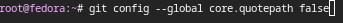{#fig-005 width=70%}

Зададим имя начальной ветки (будем называть её master): ([рис. @fig-006])

{#fig-006 width=70%}

Параметр autocrlf: ([рис. @fig-007])

{#fig-007 width=70%}

Параметр safecrlf: ([рис. @fig-008])

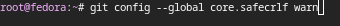{#fig-008 width=70%}

##Создайте ключи ssh

По алгоритму rsa с ключём размером 4096 бит: ([рис. @fig-009])

{#fig-009 width=70%}

По алгоритму ed25519: ([рис. @fig-010])

{#fig-010 width=70%}

##Создайте ключи pgp

Генерируем ключ: ([рис. @fig-011])

{#fig-011 width=70%}

Из предложенных опций выбираем:

    тип RSA and RSA;
    размер 4096;
    срок действия - 0(срок действия не истекает никогда).

GPG запросит личную информацию, которая сохранится в ключе, вводим:

    Имя - aplevishcheva.
    Адрес электронной почты - 1032252643@pfur.ru.
    Комментарий - оставляем это поле пустым.

##Настройка github

Создаем учётную запись на https://github.com и заполняем основные данные: ([рис. @fig-012])

{#fig-012 width=70%}

##Добавление PGP ключа в GitHub

Выводим список ключей и копируем отпечаток приватного ключа: ([рис. @fig-013])

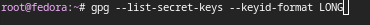{#fig-013 width=70%}

Cкопируем ваш сгенерированный PGP ключ в буфер обмена: ([рис. @fig-014])

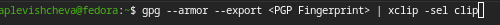{#fig-014 width=70%}

Перейдем в настройки GitHub, нажмем на кнопку New GPG key и вставим полученный ключ в поле ввода: ([рис. @fig-015])

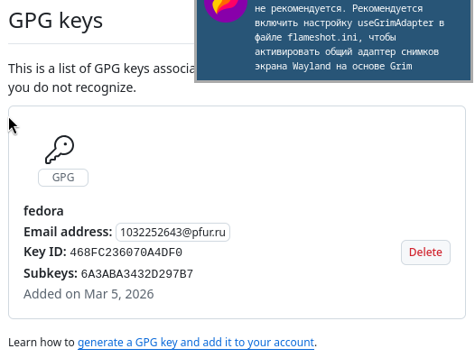{#fig-015 width=70%}

##Настройка автоматических подписей коммитов git

Используя введёный email, укажите Git применять его при подписи коммитов: ([рис. @fig-016]) ([рис. @fig-017]) ([рис. @fig-018])

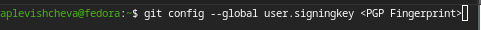{#fig-016 width=70%}
{#fig-017 width=70%}
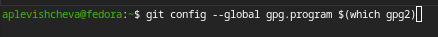{#fig-018 width=70%}

##Настройка gh

Для начала необходимо авторизоваться: ([рис. @fig-019])

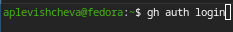{#fig-019 width=70%}

Утилита задает несколько наводящих вопросов.

Авторизуемся через броузер: ([рис. @fig-020])

{#fig-020 width=70%}

##Шаблон для рабочего пространства

###Сознание репозитория курса на основе шаблона

Cоздание репозитория: ([рис. @fig-021]) ([рис. @fig-022]) ([рис. @fig-023]) ([рис. @fig-024])

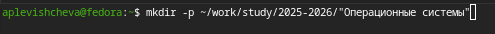{#fig-021 width=70%}
{#fig-022 width=70%}
{#fig-023 width=70%}
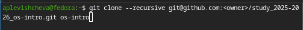{#fig-024 width=70%}

###Настройка каталога курса

Перейдем в каталог курса: ([рис. @fig-025])

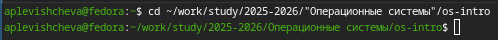{#fig-025 width=70%}

Удалим лишние файлы: ([рис. @fig-026])

{#fig-026 width=70%}

Создадим необходимые каталоги: ([рис. @fig-027]) ([рис. @fig-028])

{#fig-027 width=70%}
{#fig-028 width=70%}

Отправим файлы на сервер: ([рис. @fig-029]) ([рис. @fig-030]) ([рис. @fig-031])

{#fig-029 width=70%}
{#fig-030 width=70%}
{#fig-031 width=70%}

# Выводы

В ходе проделанной работы я изучила идеологию и применение средств контроля версий и освоила умения по работе с git.

