---
## Author
author:
  name: Levishcheva Anastasiya Petrovna
  degrees: DSc
  orcid: 0000-0002-0877-7063
  email: 1032252643@rudn.ru
  affiliation:
    - name: Российский университет дружбы народов
      country: Российская Федерация
      postal-code: 117198
      city: Москва
      address: ул. Миклухо-Маклая, д. 6

## Title
title: "Лабораторная работа № 2"
subtitle: "Архитектура компьютеров и операционные системы."
license: "Левищева Анастасия Петровна"
---

# Цель работы

    Изучить идеологию и применение средств контроля версий.
    Освоить умения по работе с git.

# Задание

    Создать базовую конфигурацию для работы с git.
    Создать ключ SSH.
    Создать ключ PGP.
    Настроить подписи git.
    Зарегистрироваться на Github.
    Создать локальный каталог для выполнения заданий по предмету.

# Теоретическое введение

##Системы контроля версий. Общие понятия

Системы контроля версий (Version Control System, VCS) применяются при работе нескольких человек над одним проектом. Обычно основное дерево проекта хранится в локальном или удалённом репозитории, к которому настроен доступ для участников проекта. При внесении изменений в содержание проекта система контроля версий позволяет их фиксировать, совмещать изменения, произведённые разными участниками проекта, производить откат к любой более ранней версии проекта, если это требуется.

###Основные команды git

    Перечислим наиболее часто используемые команды git.

    Создание основного дерева репозитория:

    git init

    Получение обновлений (изменений) текущего дерева из центрального репозитория:

    git pull

    Отправка всех произведённых изменений локального дерева в центральный репозиторий:

    git push

    Просмотр списка изменённых файлов в текущей директории:

    git status

    Просмотр текущих изменений:

    git diff

    Сохранение текущих изменений:

        добавить все изменённые и/или созданные файлы и/или каталоги:

        git add .

        добавить конкретные изменённые и/или созданные файлы и/или каталоги:

        git add имена_файлов

        удалить файл и/или каталог из индекса репозитория (при этом файл и/или каталог остаётся в локальной директории):

        git rm имена_файлов

    Сохранение добавленных изменений:

        сохранить все добавленные изменения и все изменённые файлы:

        git commit -am 'Описание коммита'

        сохранить добавленные изменения с внесением комментария через встроенный редактор:

        git commit

        создание новой ветки, базирующейся на текущей:

        git checkout -b имя_ветки

        переключение на некоторую ветку:

        git checkout имя_ветки

            (при переключении на ветку, которой ещё нет в локальном репозитории, она будет создана и связана с удалённой)

        отправка изменений конкретной ветки в центральный репозиторий:

        git push origin имя_ветки

        слияние ветки с текущим деревом:

        git merge --no-ff имя_ветки

    Удаление ветки:

        удаление локальной уже слитой с основным деревом ветки:

        git branch -d имя_ветки

        принудительное удаление локальной ветки:

        git branch -D имя_ветки

        удаление ветки с центрального репозитория:

        git push origin :имя_ветки

###Стандартные процедуры работы при наличии центрального репозитория

    Работа пользователя со своей веткой начинается с проверки и получения изменений из центрального репозитория (при этом в локальное дерево до начала этой процедуры не должно было вноситься изменений):

    git checkout master
    git pull
    git checkout -b имя_ветки

    Затем можно вносить изменения в локальном дереве и/или ветке.

    После завершения внесения какого-то изменения в файлы и/или каталоги проекта необходимо разместить их в центральном репозитории. Для этого необходимо проверить, какие файлы изменились к текущему моменту:

    git status

    При необходимости удаляем лишние файлы, которые не хотим отправлять в центральный репозиторий.

    Затем полезно просмотреть текст изменений на предмет соответствия правилам ведения чистых коммитов:

    git diff

    Если какие-либо файлы не должны попасть в коммит, то помечаем только те файлы, изменения которых нужно сохранить. Для этого используем команды добавления и/или удаления с нужными опциями:

    git add …  
    git rm …

    Если нужно сохранить все изменения в текущем каталоге, то используем:

    git add .

    Затем сохраняем изменения, поясняя, что было сделано:

    git commit -am "Some commit message"

    Отправляем изменения в центральный репозиторий:

    git push origin имя_ветки

    или

    git push

###Работа с локальным репозиторием

    Создадим локальный репозиторий.

    Сначала сделаем предварительную конфигурацию, указав имя и email владельца репозитория:

    git config --global user.name "Имя Фамилия"
    git config --global  user.email "work@mail"

    Настроим utf-8 в выводе сообщений git:

    git config --global quotepath false

    Для инициализации локального репозитория, расположенного, например, в каталоге ~/tutorial, необходимо ввести в командной строке:

    cd 
    mkdir tutorial
    cd tutorial
    git init

    После это в каталоге tutorial появится каталог .git, в котором будет храниться история изменений.

    Создадим тестовый текстовый файл hello.txt и добавим его в локальный репозиторий:

    echo 'hello world' > hello.txt
    git add hello.txt
    git commit -am 'Новый файл'

    Воспользуемся командой status для просмотра изменений в рабочем каталоге, сделанных с момента последней ревизии:

    git status

    Во время работы над проектом так или иначе могут создаваться файлы, которые не требуется добавлять в последствии в репозиторий. Например, временные файлы, создаваемые редакторами, или объектные файлы, создаваемые компиляторами. Можно прописать шаблоны игнорируемых при добавлении в репозиторий типов файлов в файл .gitignore с помощью сервисов. Для этого сначала нужно получить список имеющихся шаблонов:

    curl -L -s https://www.gitignore.io/api/list

    Затем скачать шаблон, например, для C и C++

    curl -L -s https://www.gitignore.io/api/c >> .gitignore
    curl -L -s https://www.gitignore.io/api/c++ >> .gitignore

##Базовая настройка git

###Первичная настройка параметров git

    Зададим имя и email владельца репозитория:

    git config --global user.name "Name Surname"
    git config --global user.email "work@mail"

    Настроим utf-8 в выводе сообщений git:

    git config --global core.quotepath false

    Настройте верификацию и подписание коммитов git.

    Зададим имя начальной ветки (будем называть её master):

    git config --global init.defaultBranch master

##Создание ключа ssh

###Создание ключа ssh

    Ключ ssh создаётся командой:

    ssh-keygen -t <алгоритм>

    Создайте ключи:

        по алгоритму rsa с ключём размером 4096 бит:

        ssh-keygen -t rsa -b 4096

        по алгоритму ed25519:

        ssh-keygen -t ed25519

    При создании ключа команда попросит ввести любую ключевую фразу для более надёжной защиты вашего пароля. Можно пропустить этот этап, нажав Enter.

    Сменить пароль на ключ можно с помощью команды:

    ssh-keygen -p

###Добавление SSH-ключа в учётную запись GitHub

    Скопируйте созданный SSH-ключ в буфер обмена командой:

    xclip -i < ~/.ssh/id_ed25519.pub

    Откройте настройки своего аккаунта на GitHub и перейдем в раздел SSH and GPC keys.
    Нажмите кнопку ew SSH key.
    Добавьте в поле Title название этого ключа, например, ed25519@hostname.
    Вставьте из буфера обмена в поле Key ключ.
    Нажмите кнопку Add SSH key.

# Выполнение лабораторной работы

##Установка программного обеспечения

Установим git: ([рис. @fig-001]).

{#fig-001 width=70%}

Установим gh: ([рис. @fig-002])

{#fig-002 width=70%}

##Базовая настройка git

Зададим имя и email владельца репозитория: ([рис. @fig-003]) ([рис. @fig-004])

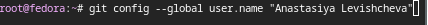{#fig-003 width=70%}

{#fig-004 width=70%}

Настроим utf-8 в выводе сообщений git: ([рис. @fig-005])

{#fig-005 width=70%}

Зададим имя начальной ветки (будем называть её master): ([рис. @fig-006])

{#fig-006 width=70%}

Параметр autocrlf: ([рис. @fig-007])

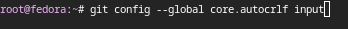{#fig-007 width=70%}

Параметр safecrlf: ([рис. @fig-008])

{#fig-008 width=70%}

##Создайте ключи ssh

По алгоритму rsa с ключём размером 4096 бит: ([рис. @fig-009])

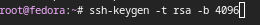{#fig-009 width=70%}

По алгоритму ed25519: ([рис. @fig-010])

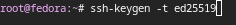{#fig-010 width=70%}

##Создайте ключи pgp

Генерируем ключ: ([рис. @fig-011])

{#fig-011 width=70%}

Из предложенных опций выбираем:

    тип RSA and RSA;
    размер 4096;
    срок действия - 0(срок действия не истекает никогда).

GPG запросит личную информацию, которая сохранится в ключе, вводим:

    Имя - aplevishcheva.
    Адрес электронной почты - 1032252643@pfur.ru.
    Комментарий - оставляем это поле пустым.

##Настройка github

Создаем учётную запись на https://github.com и заполняем основные данные: ([рис. @fig-012])

{#fig-012 width=70%}

##Добавление PGP ключа в GitHub

Выводим список ключей и копируем отпечаток приватного ключа: ([рис. @fig-013])

{#fig-013 width=70%}

Cкопируем ваш сгенерированный PGP ключ в буфер обмена: ([рис. @fig-014])

{#fig-014 width=70%}

Перейдем в настройки GitHub, нажмем на кнопку New GPG key и вставим полученный ключ в поле ввода: ([рис. @fig-015])

{#fig-015 width=70%}

##Настройка автоматических подписей коммитов git

Используя введёный email, укажите Git применять его при подписи коммитов: ([рис. @fig-016]) ([рис. @fig-017]) ([рис. @fig-018])

{#fig-016 width=70%}
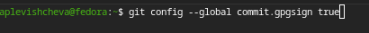{#fig-017 width=70%}
{#fig-018 width=70%}

##Настройка gh

Для начала необходимо авторизоваться: ([рис. @fig-019])

{#fig-019 width=70%}

Утилита задает несколько наводящих вопросов.

Авторизуемся через броузер: ([рис. @fig-020])

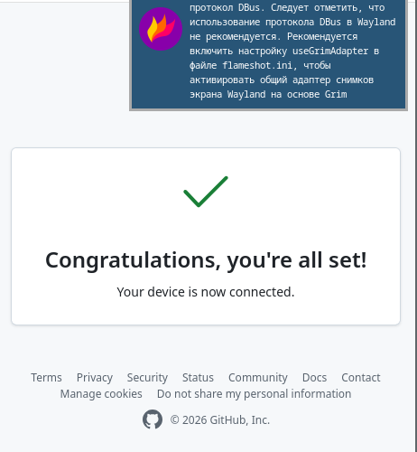{#fig-020 width=70%}

##Шаблон для рабочего пространства

###Сознание репозитория курса на основе шаблона

Cоздание репозитория: ([рис. @fig-021]) ([рис. @fig-022]) ([рис. @fig-023]) ([рис. @fig-024])

{#fig-021 width=70%}
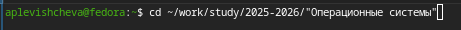{#fig-022 width=70%}
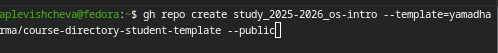{#fig-023 width=70%}
{#fig-024 width=70%}

###Настройка каталога курса

Перейдем в каталог курса: ([рис. @fig-025])

{#fig-025 width=70%}

Удалим лишние файлы: ([рис. @fig-026])

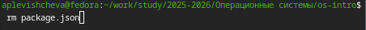{#fig-026 width=70%}

Создадим необходимые каталоги: ([рис. @fig-027]) ([рис. @fig-028])

{#fig-027 width=70%}
{#fig-028 width=70%}

Отправим файлы на сервер: ([рис. @fig-029]) ([рис. @fig-030]) ([рис. @fig-031])

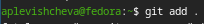{#fig-029 width=70%}
{#fig-030 width=70%}
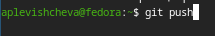{#fig-031 width=70%}

# Выводы

В ходе проделанной работы я изучила идеологию и применение средств контроля версий и освоила умения по работе с git.
    
# Список литературы{.unnumbered}

::: {#refs}
:::
