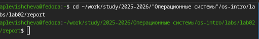
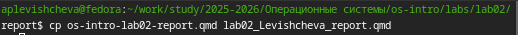
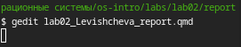
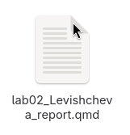
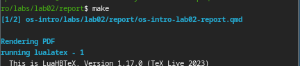
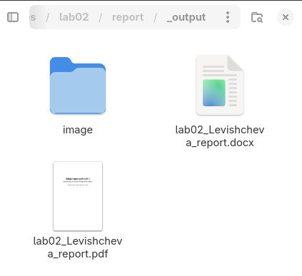

---
## Author
author:
  name: Левищева Анастасия Петровна
  degrees: DSc
  orcid: 0000-0002-0877-7063
  email: 1032252643@rudn.ru
  affiliation:
    - name: Российский университет дружбы народов
      country: Российская Федерация
      postal-code: 117198
      city: Москва
      address: ул. Миклухо-Маклая, д. 6
## Title
title: Лабораторная работа № 3
subtitle: Архитектура компьютеров и операционные системы
license: Левищева Анастасия Петровна
date: today
date-format: "2026-03-07" # Example: 2025-09-06
---

# Информация

## Докладчик

:::::::::::::: {.columns align=center}
::: {.column width="70%"}

  * Левищева Анастасия Петровна
  * group NKAbd-02-25
  * Российский университет дружбы народов им. П. Лумумбы
  * [1032252643@rudn.ru]

:::
::::::::::::::

# Цель работы

Научиться оформлять отчёты с помощью легковесного языка разметки Markdown.

# Задание

Сделайте отчёт по предыдущей лабораторной работе в формате Markdown.
В качестве отчёта просьба предоставить отчёты в 3 форматах: pdf, docx и md (в архиве,
поскольку он должен содержать скриншоты, Makefile и т.д.)

# Теоретическое введение

## Базовые сведения о Markdown

Чтобы создать заголовок, используйте знак ( # ).

Чтобы задать для текста полужирное начертание, заключите его в двойные звездочки.

Чтобы задать для текста курсивное начертание, заключите его в одинарные звездочки.

Чтобы задать для текста полужирное и курсивное начертание, заключите его в тройные
звездочки.

Блоки цитирования создаются с помощью символа >.

Неупорядоченный (маркированный) список можно отформатировать с помощью звездочек или тире.

## Обработка файлов в формате Markdown

Для обработки файлов в формате Markdown будем использовать Pandoc https://pandoc.org/. Конкретно, нам понадобится программа pandoc , pandoc-citeproc https://github.com/jgm/pandoc/releases, pandoc-crossref https://github.com/lierdakil/pandoc-crossref/releases.

## Оформление отчета по лабораторной работе

Лабораторная работа является небольшой научно-исследовательской работой, которую и оформлять следует по всем утверждённым требованиям. При подготовке отчета по лабораторной работе вы освоите ряд важных элементов, которые в дальнейшем пригодятся вам при написании курсовой и дипломной работы.

# Выполнение лабораторной работы

Перейдем в каталог для создания отчёта: ([рис. @fig-001]).

{#fig-001 width=70%}

Скопируем шаблон: ([рис. @fig-002]).

{#fig-002 width=70%}

Откроем файл в программе редактора: ([рис. @fig-003]).

{#fig-003 width=70%}

Заполним шаблон: ([рис. @fig-004]).

{#fig-004 width=70%}

Выполненим команду make: ([рис. @fig-005]).

{#fig-005 width=70%}

Получаем отчёты в 3 форматах: pdf, docx и md: ([рис. @fig-006]).

{#fig-006 width=70%}

# Выводы

В ходе проделанной работы я научилась оформлять отчёты с помощью легковесного языка разметки Markdown.

