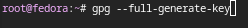
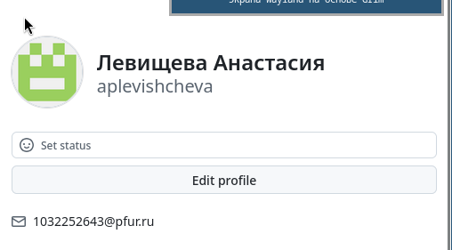
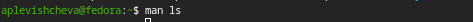
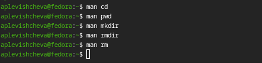
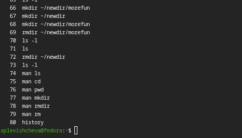
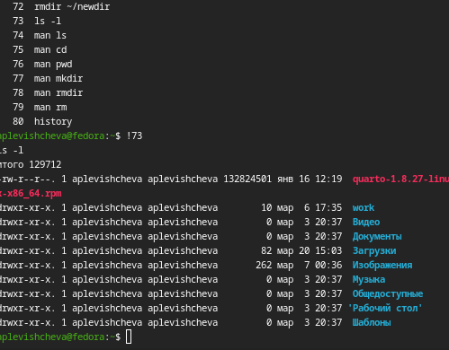

---
## Author
author:
  name: Левищева Анастасия Петровна
  degrees: DSc
  orcid: 0000-0002-0877-7063
  email: 1032252643@rudn.ru
  affiliation:
    - name: Российский университет дружбы народов
      country: Российская Федерация
      postal-code: 117198
      city: Москва
      address: ул. Миклухо-Маклая, д. 6

## Title
title: "Лабораторная работа № 6"
subtitle: "Архитектура компьютеров и операционные системы."
license: "Левищева Анастасия Петровна"
---

# Цель работы

Приобретение практических навыков взаимодействия пользователя с системой посредством командной строки.

# Задание

1. Определите полное имя вашего домашнего каталога. Далее относительно этого ката-
лога будут выполняться последующие упражнения.
2. Выполните следующие действия:
2.1. Перейдите в каталог /tmp.
2.2. Выведите на экран содержимое каталога /tmp. Для этого используйте команду ls
с различными опциями. Поясните разницу в выводимой на экран информации.
2.3. Определите, есть ли в каталоге /var/spool подкаталог с именем cron?
2.4. Перейдите в Ваш домашний каталог и выведите на экран его содержимое. Опре-
делите, кто является владельцем файлов и подкаталогов?
3. Выполните следующие действия:
3.1. В домашнем каталоге создайте новый каталог с именем newdir.
3.2. В каталоге ~/newdir создайте новый каталог с именем morefun.
3.3. В домашнем каталоге создайте одной командой три новых каталога с именами
letters, memos, misk. Затем удалите эти каталоги одной командой.
3.4. Попробуйте удалить ранее созданный каталог ~/newdir командой rm. Проверьте,
был ли каталог удалён.
3.5. Удалите каталог ~/newdir/morefun из домашнего каталога. Проверьте, был ли
каталог удалён.
4. С помощью команды man определите, какую опцию команды ls нужно использо-
вать для просмотра содержимое не только указанного каталога, но и подкаталогов,
входящих в него.
5. С помощью команды man определите набор опций команды ls, позволяющий отсорти-
ровать по времени последнего изменения выводимый список содержимого каталога
с развёрнутым описанием файлов.
6. Используйте команду man для просмотра описания следующих команд: cd, pwd, mkdir,
rmdir, rm. Поясните основные опции этих команд.
7. Используя информацию, полученную при помощи команды history, выполните мо-
дификацию и исполнение нескольких команд из буфера команд.

# Теоретическое введение

В операционной системе типа Linux взаимодействие пользователя с системой обычно осуществляется с помощью командной строки посредством построчного ввода команд. При этом обычно используется командные интерпретаторы языка shell: /bin/sh;/bin/csh; /bin/ksh.

## Формат команды. 

Командой в операционной системе называется записанный по специальным правилам текст (возможно с аргументами), представляющий собой указание на выполнение какой-либо функций (или действий) в операционной системе. Обычно первым словом идёт имя команды, остальной текст — аргументы или опции,конкретизирующие действие.

Общий формат команд можно представить следующим образом:

<имя_команды><разделитель><аргументы>

## Команда man. 

Команда man используется для просмотра (оперативная помощь) в диалоговом режиме руководства (manual) по основным командам операционной системы типа Linux.

Формат команды:

man <команда>

## Команда cd. 

Команда cd используется для перемещения по файловой системе операционной системы типа Linux.

## Команда pwd. 

Для определения абсолютного пути к текущему каталогу используется команда pwd (print working directory).

## Команда ls. 

Команда ls используется для просмотра содержимого каталога.

Формат команды:

ls [-опции] [путь]

## Команда mkdir. 

Команда mkdir используется для создания каталогов.

Формат команды:

mkdir имя_каталога1 [имя_каталога2...]

## Команда rm. 

Команда rm используется для удаления файлов и/или каталогов.

Формат команды:

rm [-опции] [файл]

Если требуется, чтобы выдавался запрос подтверждения на удаление файла, то необходимо использовать опцию i.
Чтобы удалить каталог, содержащий файлы, нужно использовать опцию r. Без указания этой опции команда не будет выполняться.

## Команда history. 

Для вывода на экран списка ранее выполненных команд используется команда history. Выводимые на экран команды в списке нумеруются. К любой команде из выведенного на экран списка можно обратиться по её номеру в списке, воспользовавшись конструкцией !<номер_команды>.

# Выполнение лабораторной работы

1. Определите полное имя вашего домашнего каталога: ([рис. @fig-001]).

{#fig-001 width=70%}

2. Выполните следующие действия:

2.1. Перейдите в каталог /tmp: ([рис. @fig-002]).

{#fig-002 width=70%}

2.2. Выведите на экран содержимое каталога /tmp: ([рис. @fig-003]). ([рис. @fig-004]). ([рис. @fig-005]). ([рис. @fig-006]).

{#fig-003 width=70%}
{#fig-003 width=70%}
{#fig-003 width=70%}
{#fig-003 width=70%}

Используйте различные опции команды ls:
ls # стандартный вывод
ls -l # длинный формат, показывает подробную информацию о файлах
ls -a # показывает все файлы, включая скрытые (начинающиеся с точки)
ls -lh # длинный формат с размером файлов в удобочитаемом формате

Объяснение:
• ls — выводит имена файлов.
• ls -l — выводит подробную информацию (права доступа, владелец, размер и дата).
• ls -a — добавляет скрытые файлы.
• ls -lh — показывает размер файлов в удобочитаемом формате (КБ, МБ и т.д.).

2.3. Определите, есть ли в каталоге /var/spool подкаталог с именем cron: ([рис. @fig-007]).

{#fig-007 width=70%}

Если подкаталог существует, он будет выведен на экран.

2.4. Перейдите в Ваш домашний каталог и выведите на экран его содержимое: ([рис. @fig-008]).

{#fig-008 width=70%}

Объяснение: В команде ls -l вы увидите владельца файлов и подкаталогов, который будет указан в первой колонке вывода.

3. Выполните следующие действия:

3.1. В домашнем каталоге создайте новый каталог с именем newdir: ([рис. @fig-009]).

{#fig-009 width=70%}

3.2. В каталоге ~/newdir создайте новый каталог с именем morefun: ([рис. @fig-010]).

{#fig-010 width=70%}

3.3. В домашнем каталоге создайте одной командой три новых каталога с именами letters, memos, misk. Затем удалите эти каталоги одной командой: ([рис. @fig-011]).

{#fig-011 width=70%}

3.4. Попробуйте удалить ранее созданный каталог ~/newdir командой rm. Проверьте, был ли каталог удалён: ([рис. @fig-012]).

{#fig-012 width=70%}

rm -r ~/newdir # Используйте -r для рекурсивного удаления каталога и его содержимого.
ls -l # Проверьте, был ли каталог удалён.

3.5. Удалите каталог ~/newdir/morefun из домашнего каталога. Проверьте, был ли каталог удалён: ([рис. @fig-013]).

{#fig-013 width=70%}

rmdir ~/newdir/morefun # Удаление каталога morefun
ls -l # Проверьте, был ли каталог удалён.

4. С помощью команды man определите, какую опцию команды ls нужно использовать для просмотра содержимого не только указанного каталога, но и подкаталогов, входящих в него: ([рис. @fig-014]). ([рис. @fig-015]).

{#fig-014 width=70%}
{#fig-015 width=70%}

5. С помощью команды man определите набор опций команды ls, позволяющий отсортировать по времени последнего изменения выводимый список содержимого каталога с развёрнутым описанием файлов: ([рис. @fig-016]). ([рис. @fig-017]).

{#fig-016 width=70%}
{#fig-017 width=70%}

-l #длинный формат
-t #сортировка по времени

Опциия -lt (длинный формат и сортировка по времени).

6. Используйте команду man для просмотра описания следующих команд: cd, pwd, mkdir, rmdir, rm: ([рис. @fig-018]).

{#fig-018 width=70%}

Объяснение основных опций:
• cd [директория] — смена текущего каталога.
• pwd — вывод текущего рабочего каталога.
• mkdir [каталог] — создание нового каталога.
• rmdir [каталог] — удаление пустого каталога.
• rm [опции] [файлы] — удаление файлов; опция -r для рекурсивного удаления.

7. Используя информацию, полученную при помощи команды history, выполните модификацию и исполнение нескольких команд из буфера команд: ([рис. @fig-019]).

{#fig-019 width=70%}

Для повторного выполнения команды используйте !номер, где номер — это номер команды в истории: ([рис. @fig-020]).

{#fig-020 width=70%}

# Выводы

Я приобрела практические навыки взаимодействия пользователя с системой посредством командной строки.

