---
## Author
author:
  name: Левищева Анастасия Петровна
  degrees: DSc
  orcid: 0000-0002-0877-7063
  email: 1032252643@rudn.ru
  affiliation:
    - name: Российский университет дружбы народов
      country: Российская Федерация
      postal-code: 117198
      city: Москва
      address: ул. Миклухо-Маклая, д. 6

## Title
title: "Лабораторная работа № 7"
subtitle: "Архитектура компьютеров и операционные системы."
license: "Левищева Анастасия Петровна"
---

# Цель работы

Ознакомление с файловой системой Linux, её структурой, именами и содержанием каталогов. Приобретение практических навыков по применению команд для работы с файлами и каталогами, по управлению процессами (и работами), по проверке использования диска и обслуживанию файловой системы.

# Задание

1. Выполните все примеры, приведённые в первой части описания лабораторной работы.

2. Выполните следующие действия, зафиксировав в отчёте по лабораторной работе используемые при этом команды и результаты их выполнения:

2.1. Скопируйте файл /usr/include/sys/io.h в домашний каталог и назовите его equipment. Если файла io.h нет, то используйте любой другой файл в каталоге /usr/include/sys/ вместо него.

2.2. В домашнем каталоге создайте директорию ~/ski.plases.

2.3. Переместите файл equipment в каталог ~/ski.plases.

2.4. Переименуйте файл ~/ski.plases/equipment в ~/ski.plases/equiplist.

2.5. Создайте в домашнем каталоге файл abc1 и скопируйте его в каталог ~/ski.plases, назовите его equiplist2.

2.6. Создайте каталог с именем equipment в каталоге ~/ski.plases.

2.7. Переместите файлы ~/ski.plases/equiplist и equiplist2 в каталог ~/ski.plases/equipment.

2.8. Создайте и переместите каталог ~/newdir в каталог ~/ski.plases и назовите его plans.

3. Определите опции команды chmod, необходимые для того, чтобы присвоить перечисленным ниже файлам выделенные права доступа, считая, что в начале таких прав нет:

3.1. drwxr--r-- ... australia
3.2. drwx--x--x ... play
3.3. -r-xr--r-- ... my_os
3.4. -rw-rw-r-- ... feathers

При необходимости создайте нужные файлы.

4. Проделайте приведённые ниже упражнения, записывая в отчёт по лабораторной работе используемые при этом команды:

4.1. Просмотрите содержимое файла /etc/password.

4.2. Скопируйте файл ~/feathers в файл ~/file.old.

4.3. Переместите файл ~/file.old в каталог ~/play.

4.4. Скопируйте каталог ~/play в каталог ~/fun.

4.5. Переместите каталог ~/fun в каталог ~/play и назовите его games.

4.6. Лишите владельца файла ~/feathers права на чтение.

4.7. Что произойдёт, если вы попытаетесь просмотреть файл ~/feathers командой cat?

4.8. Что произойдёт, если вы попытаетесь скопировать файл ~/feathers?

4.9. Дайте владельцу файла ~/feathers право на чтение.

4.10. Лишите владельца каталога ~/play права на выполнение.

4.11. Перейдите в каталог ~/play. Что произошло?

4.12. Дайте владельцу каталога ~/play право на выполнение.

5. Прочитайте man по командам mount, fsck, mkfs, kill и кратко их охарактеризуйте,приведя примеры.

# Теоретическое введение

## Команды для работы с файлами и каталогами

Для создания текстового файла можно использовать команду touch.
Формат команды:
touch имя-файла

Для просмотра файлов небольшого размера можно использовать команду cat.
Формат команды:
cat имя-файла

Для просмотра файлов постранично удобнее использовать команду less.
Формат команды:
less имя-файла

Команда head выводит по умолчанию первые 10 строк файла.
Формат команды:
head [-n] имя-файла,
где n — количество выводимых строк.

Команда tail выводит умолчанию 10 последних строк файла.
Формат команды:
tail [-n] имя-файла,
где n — количество выводимых строк

## Копирование файлов и каталогов

Команда cp используется для копирования файлов и каталогов.
Формат команды:
cp [-опции] исходный_файл целевой_файл

## Перемещение и переименование файлов и каталогов

Команды mv и mvdir предназначены для перемещения и переименования файлов и каталогов.
Формат команды mv:
mv [-опции] старый_файл новый_файл

## Права доступа

Каждый файл или каталог имеет права доступа.
В сведениях о файле или каталоге указываются:

– тип файла (символ (-) обозначает файл, а символ (d) — каталог);

– права для владельца файла (r — разрешено чтение, w — разрешена запись, x — разрешено выполнение, - — право доступа отсутствует);

– права для членов группы (r — разрешено чтение, w — разрешена запись, x — разрешено выполнение, - — право доступа отсутствует);

– права для всех остальных (r — разрешено чтение, w — разрешена запись, x — разрешено выполнение, - — право доступа отсутствует)

## Изменение прав доступа

Права доступа к файлу или каталогу можно изменить, воспользовавшись командой chmod. Сделать это может владелец файла (или каталога) или пользователь с правами администратора.
Формат команды:
chmod режим имя_файла

# Выполнение лабораторной работы

1. Выполните все примеры, приведённые в первой части описания лабораторной работы.

cp: ([рис. @fig-001]).

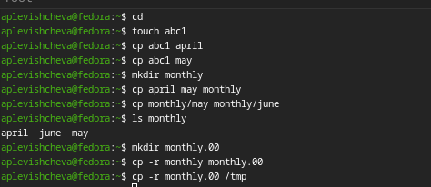{#fig-001 width=70%}

mv: ([рис. @fig-002]).

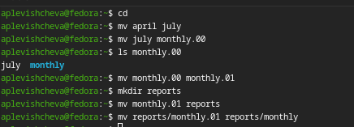{#fig-002 width=70%}

chmod: ([рис. @fig-003]).

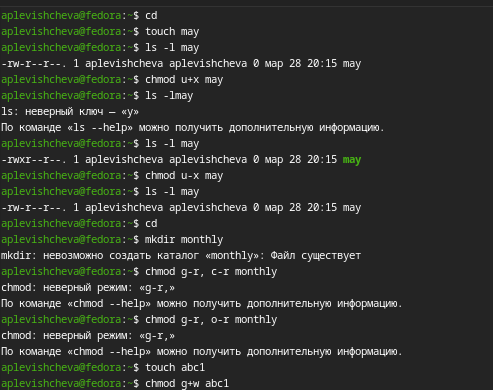{#fig-003 width=70%}

fsck: ([рис. @fig-004]).

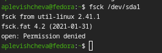{#fig-004 width=70%}

2. Работа с файлами и директориями

2.1. Скопируйте файл /usr/include/sys/io.h в домашний каталог и назовите его equipment. ([рис. @fig-005]).

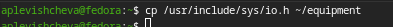{#fig-005 width=70%}

Файл equipment был успешно создан в домашнем каталоге.

2.2. В домашнем каталоге создайте директорию ~/ski.plases. ([рис. @fig-006]).

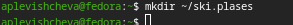{#fig-006 width=70%}

Директория ski.plases была успешно создана.

2.3. Переместите файл equipment в каталог ~/ski.plases. ([рис. @fig-007]).

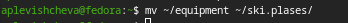{#fig-007 width=70%}

Файл equipment был перемещен в каталог ~/ski.plases.

2.4. Переименуйте файл ~/ski.plases/equipment в ~/ski.plases/equiplist. ([рис. @fig-008]).

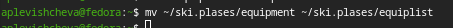{#fig-008 width=70%}

Файл был переименован в equiplist.

2.5. Создайте в домашнем каталоге файл abc1 и скопируйте его в каталог ~/ski.plases, назовите его equiplist2. ([рис. @fig-009]).

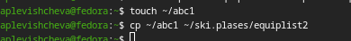{#fig-009 width=70%}

Файл abc1 был создан и скопирован как equiplist2.

2.6. Создайте каталог с именем equipment в каталоге ~/ski.plases. ([рис. @fig-010]).

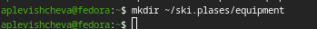{#fig-010 width=70%}

Каталог equipment был успешно создан.

2.7. Переместите файлы ~/ski.plases/equiplist и equiplist2 в каталог ~/ski.plases/equipment. ([рис. @fig-011]).

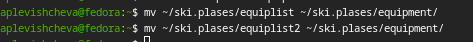{#fig-011 width=70%}

Оба файла были перемещены в каталог equipment.

2.8. Создайте и переместите каталог ~/newdir в каталог ~/ski.plases и назовите его plans. ([рис. @fig-012]).

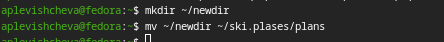{#fig-012 width=70%}

Каталог newdir был перемещен и переименован в plans.

3. Изменение прав доступа

3.1. ([рис. @fig-013]).

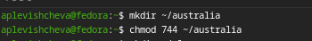{#fig-013 width=70%}

3.2. ([рис. @fig-014]).

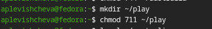{#fig-014 width=70%}

3.3. ([рис. @fig-015]).

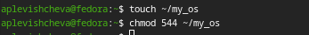{#fig-015 width=70%}

3.4. ([рис. @fig-016]).

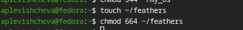{#fig-016 width=70%}

4. Работа с файлами

4.1. Просмотрите содержимое файла /etc/passwd. ([рис. @fig-017]).

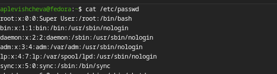{#fig-017 width=70%}

4.2. Скопируйте файл ~/feathers в файл ~/file.old. ([рис. @fig-018]).

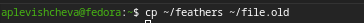{#fig-018 width=70%}

4.3. Переместите файл ~/file.old в каталог ~/play. ([рис. @fig-019]).

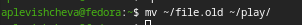{#fig-019 width=70%}

4.4. Скопируйте каталог ~/play в каталог ~/fun. ([рис. @fig-020]).

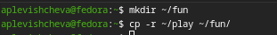{#fig-020 width=70%}

4.5. Переместите каталог ~/fun в каталог ~/play и назовите его games. ([рис. @fig-021]).

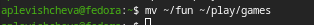{#fig-021 width=70%}

4.6. Лишите владельца файла ~/feathers права на чтение. ([рис. @fig-022]).

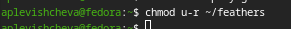{#fig-022 width=70%}

4.7. Что произойдёт, если вы попытаетесь просмотреть файл ~/feathers командой cat?

Команда cat вернет ошибку "Permission denied".

4.8. Что произойдёт, если вы попытаетесь скопировать файл ~/feathers?

Команда cp вернет ошибку "Permission denied".

4.9. Дайте владельцу файла ~/feathers право на чтение. ([рис. @fig-023]).

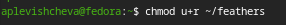{#fig-023 width=70%}

4.10. Лишите владельца каталога ~/play права на выполнение. ([рис. @fig-024]).

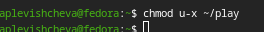{#fig-024 width=70%}

4.11. Перейдите в каталог ~/play. Что произошло?

Получили ошибку "Permission denied".

4.12. Дайте владельцу каталога ~/play право на выполнение. ([рис. @fig-025]).

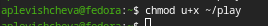{#fig-025 width=70%}

5. Краткое описание команд

([рис. @fig-026]).

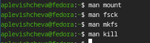{#fig-026 width=70%}

• mount: используется для подключения файловых систем к точкам монтирования.
  – Пример: mount /dev/sdb1 /mnt/usb (подключение USB-накопителя).

• fsck: проверяет файловую систему на наличие ошибок и восстанавливает ее.
  – Пример: fsck /dev/sda1 (проверка первого раздела на диске).

• mkfs: создает файловую систему на разделе.

# Выводы

Я ознакомилась с файловой системой Linux, её структурой, именами и содержанием каталогов. Я приобрела практические навыки по применению команд для работы с файлами и каталогами, по управлению процессами (и работами), по проверке использования диска и обслуживанию файловой системы.
