---
## Author
author:
  name: Левищева Анастасия Петровна
  degrees: DSc
  orcid: 0000-0002-0877-7063
  email: 1032252643@rudn.ru
  affiliation:
    - name: Российский университет дружбы народов
      country: Российская Федерация
      postal-code: 117198
      city: Москва
      address: ул. Миклухо-Маклая, д. 6

## Title
title: "Лабораторная работа № 8"
subtitle: "Архитектура компьютеров и операционные системы."
license: "Левищева Анастасия Петровна"
---
# Цель работы

Ознакомление с инструментами поиска файлов и фильтрации текстовых данных. Приобретение практических навыков: по управлению процессами (и заданиями), по проверке использования диска и обслуживанию файловых систем.

# Задание

1. Осуществите вход в систему, используя соответствующее имя пользователя.

2. Запишите в файл file.txt названия файлов, содержащихся в каталоге /etc. Допишите в этот же файл названия файлов, содержащихся в вашем домашнем каталоге.

3. Выведите имена всех файлов из file.txt, имеющих расширение .conf, после чего запишите их в новый текстовой файл conf.txt.

4. Определите, какие файлы в вашем домашнем каталоге имеют имена, начинавшиеся с символа c? Предложите несколько вариантов, как это сделать.

5. Выведите на экран (по странично) имена файлов из каталога /etc, начинающиеся с символа h.

6. Запустите в фоновом режиме процесс, который будет записывать в файл ~/logfile файлы, имена которых начинаются с log.

7. Удалите файл ~/logfile.

8. Запустите из консоли в фоновом режиме редактор gedit.

9. Определите идентификатор процесса gedit, используя команду ps, конвейер и фильтр grep. Как ещё можно определить идентификатор процесса?

10. Прочтите справку (man) команды kill, после чего используйте её для завершения процесса gedit.

11. Выполните команды df и du, предварительно получив более подробную информацию об этих командах, с помощью команды man.

12. Воспользовавшись справкой команды find, выведите имена всех директорий, имеющихся в вашем домашнем каталоге.

# Теоретическое введение

## Перенаправление ввода-вывода

В системе по умолчанию открыто три специальных потока:

– stdin — стандартный поток ввода (по умолчанию: клавиатура), файловый дескриптор 0;
– stdout — стандартный поток вывода (по умолчанию: консоль), файловый дескриптор 1;
– stderr — стандартный поток вывод сообщений об ошибках (по умолчанию: консоль), файловый дескриптор 2.

Создаёт файл, содержащий список дерева каталогов.
ls -lR > dir-tree.list

1>filename
Перенаправление вывода (stdout) в файл "filename".
1>>filename
Перенаправление вывода (stdout) в файл "filename", файл открывается в режиме добавления.
2>filename
Перенаправление stderr в файл "filename".
2>>filename
Перенаправление stderr в файл "filename", файл открывается в режиме добавления.
&>filename
Перенаправление stdout и stderr в файл "filename".

## Конвейер

Конвейер (pipe) служит для объединения простых команд или утилит в цепочки, в которых результат работы предыдущей команды передаётся последующей. Синтаксис следующий:

команда 1 | команда 2

означает, что вывод команды 1 передастся на ввод команде 2

Конвейеры можно группировать в цепочки и выводить с помощью перенаправления в файл, например:

ls -la |sort > sortilg_list

вывод команды ls -la передаётся команде сортировки sort\verb, которая пишет результат в файл sorting_list\verb.

## Поиск файла

Команда find используется для поиска и отображения на экран имён файлов, соответствующих заданной строке символов.

Формат команды:
find путь [-опции]

Путь определяет каталог, начиная с которого по всем подкаталогам будет вестись поиск.

## Фильтрация текста

Найти в текстовом файле указанную строку символов позволяет команда grep.

Формат команды:
grep строка имя_файла

Кроме того, команда grep способна обрабатывать стандартный вывод других команд(любой текст). Для этого следует использовать конвейер, связав вывод команды с вводом grep.

## Проверка использования диска
Команда df показывает размер каждого смонтированного раздела диска.

Формат команды:
df [-опции] [файловая_система]

Команда du показывает число килобайт, используемое каждым файлом или каталогом.

Формат команды:
du [-опции] [имя_файла...]

## Управление задачами

Любую выполняющуюся в консоли команду или внешнюю программу можно запустить в фоновом режиме. Для этого следует в конце имени команды указать знак амперсанда &. Консоль при этом не будет заблокирована.

Запущенные фоном программы называются задачами (jobs). Ими можно управлять с помощью команды jobs, которая выводит список запущенных в данный момент задач.

Для завершения задачи необходимо выполнить команду
kill %номер задачи

## Получение информации о процессах

Команда ps используется для получения информации о процессах.

Формат команды:
ps [-опции]

Для получения информации о процессах, управляемых вами и запущенных (работающих или остановленных) на вашем терминале, используйте опцию aux.

# Выполнение лабораторной работы

1. ([рис. @fig-001]).

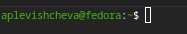{#fig-001 width=70%}

2. ([рис. @fig-002]).

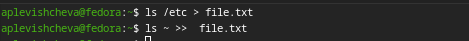{#fig-002 width=70%}

3. ([рис. @fig-003]). 

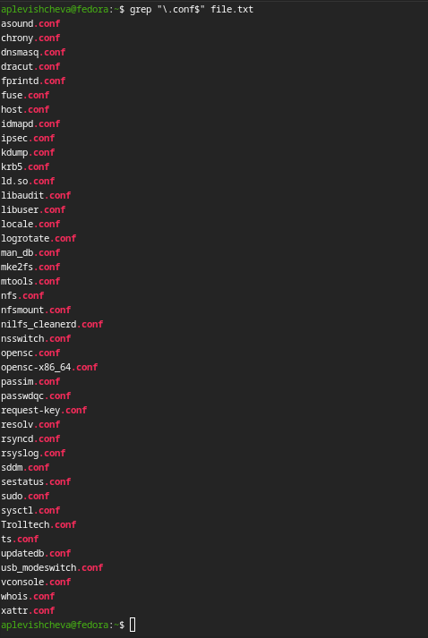{#fig-003 width=70%}

([рис. @fig-004]).

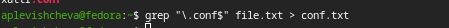{#fig-004 width=70%}

4. ([рис. @fig-005]).

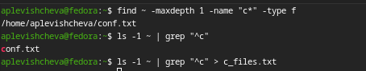{#fig-005 width=70%}

5. ([рис. @fig-006]). 

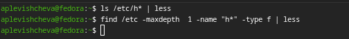{#fig-006 width=70%}

([рис. @fig-007]).

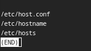{#fig-007 width=70%}

6. ([рис. @fig-008]).

{#fig-008 width=70%}

7. ([рис. @fig-009]).

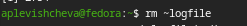{#fig-009 width=70%}

8. ([рис. @fig-010]).

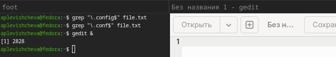{#fig-010 width=70%}

9. ([рис. @fig-011]).

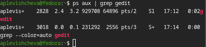{#fig-011 width=70%}

10. ([рис. @fig-012]).

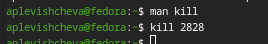{#fig-012 width=70%}

11. ([рис. @fig-013]).

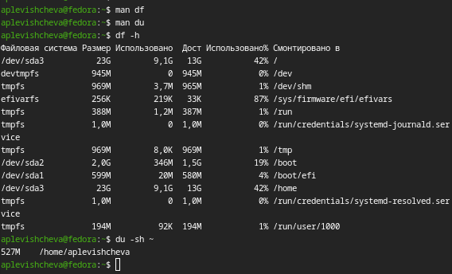{#fig-013 width=70%}

12. ([рис. @fig-014]). 

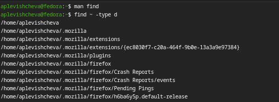{#fig-014 width=70%}

([рис. @fig-015]).

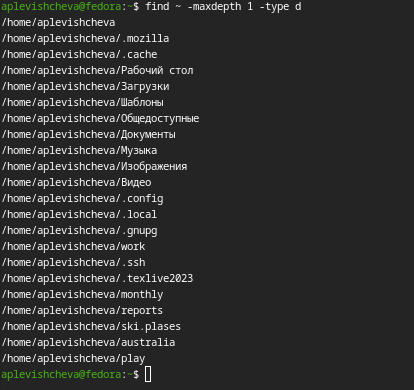{#fig-015 width=70%}

# Выводы

Я ознакомилась с инструментами поиска файлов и фильтрации текстовых данных. Приобрела практические навыки: по управлению процессами (и заданиями), по проверке использования диска и обслуживанию файловых систем.

