---
## Author
author:
  name: Левищева Анастасия Петровна
  degrees: DSc
  orcid: 0000-0002-0877-7063
  email: 1032252643@rudn.ru
  affiliation:
    - name: Российский университет дружбы народов
      country: Российская Федерация
      postal-code: 117198
      city: Москва
      address: ул. Миклухо-Маклая, д. 6

## Title
title: "Лабораторная работа № 9"
subtitle: "Архитектура компьютеров и операционные системы."
license: "Левищева Анастасия Петровна"
---

# Цель работы

Освоение основных возможностей командной оболочки Midnight Commander. Приобретение навыков практической работы по просмотру каталогов и файлов; манипуляций с ними.

# Задание

## Задание по mc

1. Изучите информацию о mc, вызвав в командной строке man mc.

2. Запустите из командной строки mc, изучите его структуру и меню.

3. Выполните несколько операций в mc, используя управляющие клавиши (операции с панелями; выделение/отмена выделения файлов, копирование/перемещение файлов, получение информации о размере и правах доступа на файлы и/или каталоги и т.п.)

4. Выполните основные команды меню левой (или правой) панели. Оцените степень подробности вывода информации о файлах.

5. Используя возможности подменю Файл , выполните:

– просмотр содержимого текстового файла;
– редактирование содержимого текстового файла (без сохранения результатов редактирования);
– создание каталога;
– копирование в файлов в созданный каталог.

6. С помощью соответствующих средств подменю Команда осуществите:

– поиск в файловой системе файла с заданными условиями (например, файла с расширением .c или .cpp, содержащего строку main);
– выбор и повторение одной из предыдущих команд;
– переход в домашний каталог;
– анализ файла меню и файла расширений.

7. Вызовите подменю Настройки . Освойте операции, определяющие структуру экрана mc (Full screen, Double Width, Show Hidden Files и т.д.)ю

## Задание по встроенному редактору mc

1. Создайте текстовой файл text.txt.

2. Откройте этот файл с помощью встроенного в mc редактора.

3. Вставьте в открытый файл небольшой фрагмент текста, скопированный из любого другого файла или Интернета.

4. Проделайте с текстом следующие манипуляции, используя горячие клавиши:

4.1. Удалите строку текста.

4.2. Выделите фрагмент текста и скопируйте его на новую строку.

4.3. Выделите фрагмент текста и перенесите его на новую строку.

4.4. Сохраните файл.

4.5. Отмените последнее действие.

4.6. Перейдите в конец файла (нажав комбинацию клавиш) и напишите некоторый текст.

4.7. Сохраните и закройте файл.

5. Откройте файл с исходным текстом на некотором языке программирования (например C или Java)

6. Используя меню редактора, включите подсветку синтаксиса, если она не включена, или выключите, если она включена.

# Теоретическое введение

Командная оболочка — интерфейс взаимодействия пользователя с операционной системой и программным обеспечением посредством команд.

Midnight Commander (или mc) — псевдографическая командная оболочка для UNIX/Linux систем.

Панель в mc отображает список файлов текущего каталога. Абсолютный путь к этому каталогу отображается в заголовке панели. У активной панели заголовок и одна из её строк подсвечиваются. Управление панелями осуществляется с помощью определённых комбинаций клавиш или пунктов меню mc.

# Выполнение лабораторной работы

## Задание по встроенному редактору mc

1. Создайте текстовой файл text.txt:
   
   Откройте терминал и выполните команду: touch text.txt
      
([рис. @fig-001]).

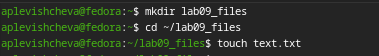{#fig-001 width=70%}

2. Откройте этот файл с помощью встроенного в mc редактора:
   
   Запустите Midnight Commander, выполнив команду: mc. Перейдите к файлу text.txt с помощью стрелок и нажмите F4, чтобы открыть его в редакторе.

([рис. @fig-002]).

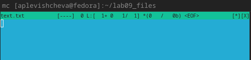{#fig-002 width=70%}

3. Вставьте в открытый файл небольшой фрагмент текста:
   
   Скопируйте текст из другого файла или Интернета и вставьте его в редактор, нажав Shift + Insert или Ctrl + Shift + V.
   
([рис. @fig-003]).

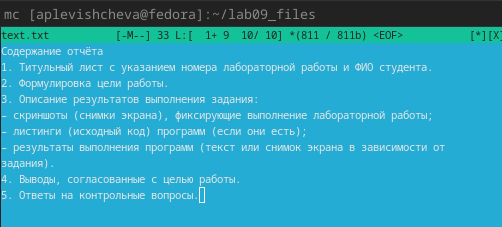{#fig-003 width=70%}

4. Проделайте с текстом следующие манипуляции, используя горячие клавиши:

   4.1. Удалите строку текста:
   
   Переместите курсор на строку, которую хотите удалить, и нажмите Ctrl + K.

([рис. @fig-004]).

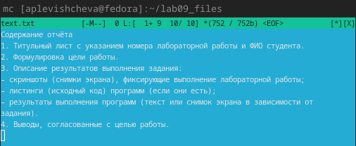{#fig-004 width=70%}

   4.2. Выделите фрагмент текста и скопируйте его на новую строку:
   
   Используйте Shift + стрелки для выделения текста. После выделения нажмите Ctrl + Shift + C, чтобы скопировать, затем переместите курсор на новую строку и нажмите Ctrl + Shift + V, чтобы вставить.

([рис. @fig-005]).

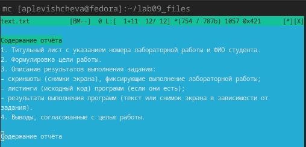{#fig-005 width=70%}

   4.3. Выделите фрагмент текста и перенесите его на новую строку:
   
   Снова выделите текст с помощью Shift + стрелки, затем нажмите Ctrl + K, чтобы удалить выделенный текст, переместите курсор на новую строку и нажмите Ctrl + Shift + V, чтобы вставить.
   
([рис. @fig-006]).

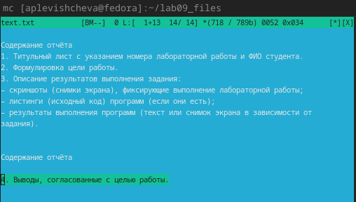{#fig-006 width=70%}

   4.4. Сохраните файл:
   Нажмите F2, чтобы открыть меню, и выберите "Save" (или просто нажмите F2).
   
([рис. @fig-007]).

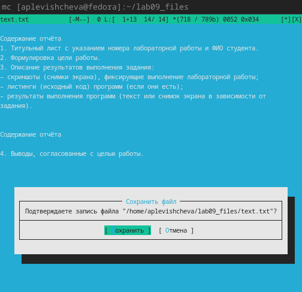{#fig-007 width=70%}

   4.5. Отмените последнее действие:
   Нажмите Ctrl + U, чтобы отменить последнее действие.
   
([рис. @fig-008]).

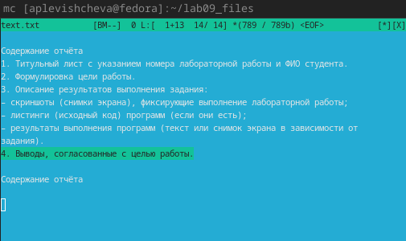{#fig-008 width=70%}

   4.6. Перейдите в конец файла (нажав комбинацию клавиш) и напишите некоторый текст:
   Нажмите Ctrl + End, чтобы перейти в конец файла, и введите ваш текст.
   
([рис. @fig-009]).

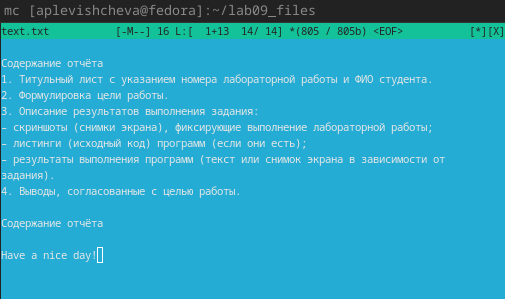{#fig-009 width=70%}

   4.7. Сохраните и закройте файл:
   Нажмите F2 для сохранения, затем F10, чтобы закрыть редактор.
   
([рис. @fig-011]).

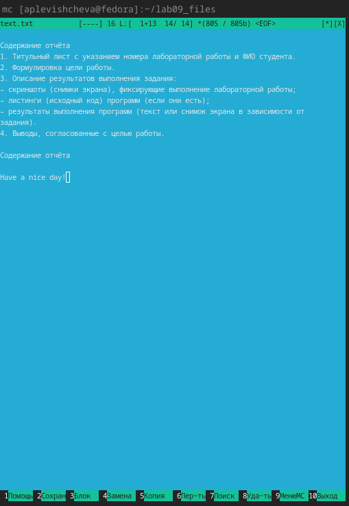{#fig-011 width=70%}

5. Откройте файл с исходным текстом на некотором языке программирования (например, C или Java):
   В Midnight Commander перейдите к нужному файлу с кодом и откройте его с помощью F4.
   
([рис. @fig-011]).

{#fig-011 width=70%}

6. Используя меню редактора, включите подсветку синтаксиса:
   Если подсветка синтаксиса не включена, нажмите F9, чтобы открыть меню, затем выберите "Options" -> "Syntax highlighting". Включите или выключите подсветку синтаксиса по вашему усмотрению.
   
([рис. @fig-012]).

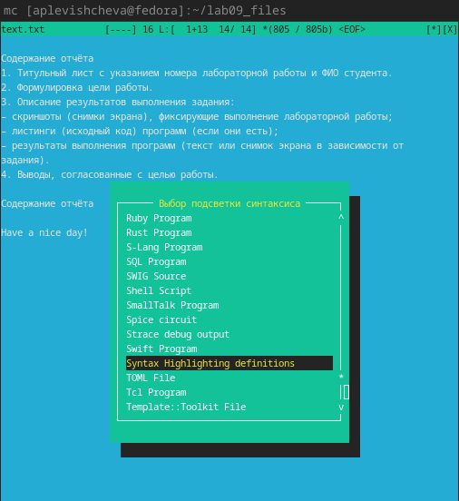{#fig-012 width=70%}

## Задание по mc

1. Изучите информацию о mc, вызвав в командной строке man mc.

([рис. @fig-013]).

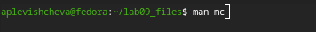{#fig-013 width=70%}

2. Запустите из командной строки mc, изучите его структуру и меню.

([рис. @fig-014]).

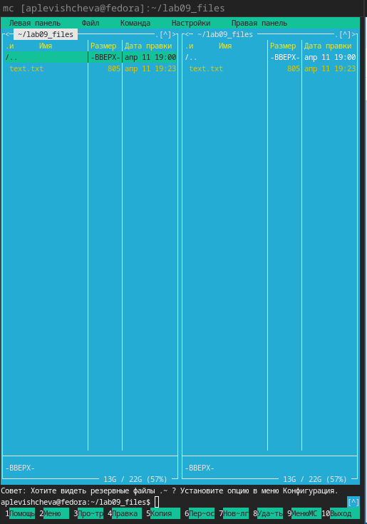{#fig-014 width=70%}

3. Операции в mc

Управление панелями:
   – Переключение между панелями: Нажмите Tab.
   – Перемещение по каталогам: Используйте стрелки ↑ и ↓ для перемещения по списку файлов и Enter для открытия каталога.

3. Выделение/отмена выделения файлов:
   – Для выделения файла, переместите курсор на файл и нажмите Insert. Выделенный файл будет отмечен символом *.
   
([рис. @fig-015]).

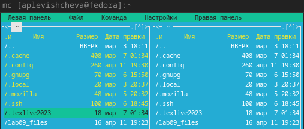{#fig-015 width=70%}

([рис. @fig-016]).

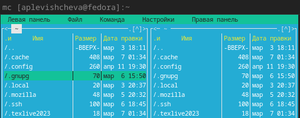{#fig-016 width=70%}

4. Копирование/перемещение файлов:
   – Чтобы скопировать выделенные файлы, нажмите F5. В открывшемся диалоговом окне выберите целевую директорию и нажмите Enter.
   
([рис. @fig-017]).

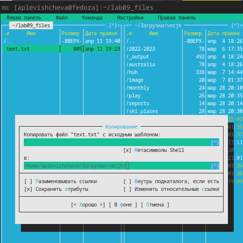{#fig-017 width=70%}

   – Чтобы переместить файлы, используйте F6 и следуйте аналогичным шагам.
   
([рис. @fig-018]).

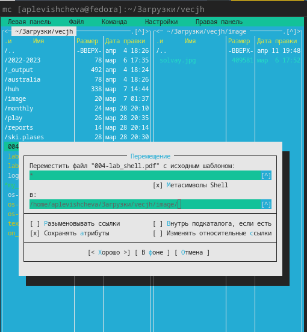{#fig-018 width=70%}

5. Получение информации о размере и правах доступа на файлы:
   – Переместите курсор на файл и нажмите F3, чтобы открыть окно с информацией о файле, включая размер и права доступа.
   
([рис. @fig-019]).

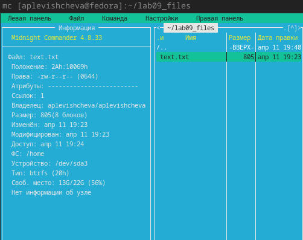{#fig-019 width=70%}

4. Основные команды меню панели

1. Откройте меню левой или правой панели:
   – Нажмите F9, чтобы открыть меню.
   – Выберите "File" или "Directory" для выполнения команд.

2. Оцените степень подробности вывода информации о файлах:
   – При выборе файла и нажатии F3 вы увидите подробную информацию о выбранном файле, включая его размер, права доступа, дату изменения и т.д.
   
([рис. @fig-019]).

{#fig-019 width=70%}

5. Подменю Файл

1. Просмотр содержимого текстового файла:
   – Переместите курсор на текстовый файл и нажмите F3.
   
([рис. @fig-020]).

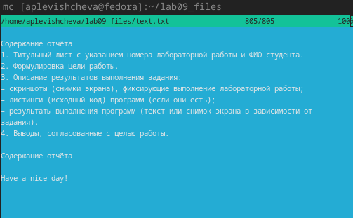{#fig-020 width=70%}

2. Редактирование содержимого текстового файла (без сохранения):
   – Нажмите F4, чтобы открыть редактор. После редактирования просто закройте редактор, нажав F10, и не сохраняйте изменения.
   
([рис. @fig-021]).

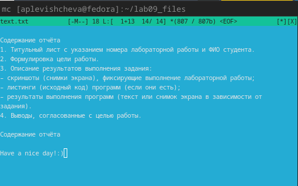{#fig-021 width=70%}

3. Создание каталога:
   – Нажмите F7, введите имя нового каталога и нажмите Enter.
   
([рис. @fig-022]).

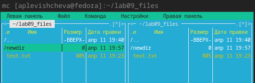{#fig-022 width=70%}

4. Копирование файлов в созданный каталог:
   – Выделите файлы, которые хотите скопировать, затем нажмите F5, выберите созданный каталог как целевой и нажмите Enter.
   
([рис. @fig-023]).

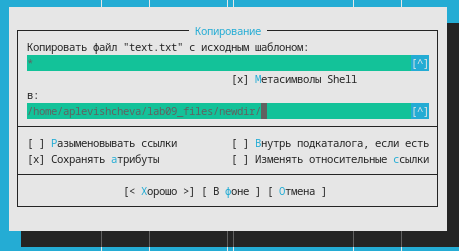{#fig-023 width=70%}

6. Подменю Команда

1. Поиск файла с заданными условиями:
   – Нажмите F9, выберите "Command", затем "Find File" (или просто нажмите Ctrl + Shift + F), введите условие поиска (например, *.c или *.cpp) и нажмите Enter.
   
([рис. @fig-024]).

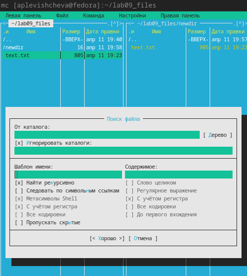{#fig-024 width=70%}

3. Переход в домашний каталог:
   – Нажмите Ctrl + Home или введите команду cd ~ в терминале.
   
([рис. @fig-025]).

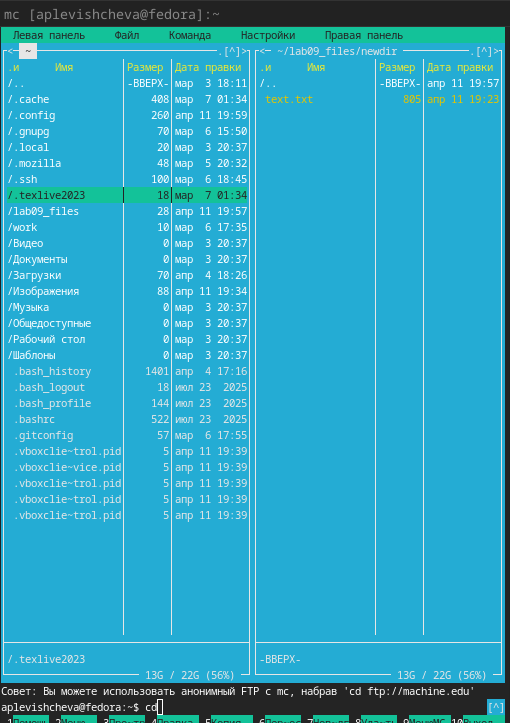{#fig-025 width=70%}

7. Подменю Настройки

1. Вызовите подменю Настройки:
   – Нажмите F9, выберите "Options".
   
([рис. @fig-026]).

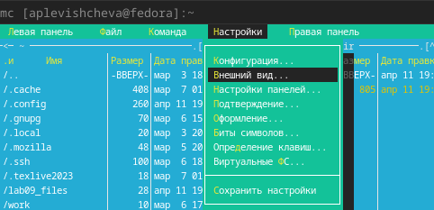{#fig-026 width=70%}

2. Освойте операции, определяющие структуру экрана mc:
   – Включите/выключите "Full screen" для полноэкранного режима.
   – Включите/выключите "Double Width" для изменения ширины панелей.
   – Включите/выключите "Show Hidden Files" для отображения скрытых файлов.

# Выводы

Я освоила основные возможности командной оболочки Midnight Commander. Приобрела навыки практической работы по просмотру каталогов и файлов; манипуляций с ними.

