---
## Author
author:
  name: Левищева Анастасия Петровна
  degrees: DSc
  orcid: 0000-0002-0877-7063
  email: 1032252643@rudn.ru
  affiliation:
    - name: Российский университет дружбы народов
      country: Российская Федерация
      postal-code: 117198
      city: Москва
      address: ул. Миклухо-Маклая, д. 6

## Title
title: "Лабораторная работа № 11"
subtitle: "Архитектура компьютеров и операционные системы."
license: "Левищева Анастасия Петровна"
---

# Цель работы

Познакомиться с операционной системой Linux. Получить практические навыки работы с редактором Emacs.

# Задание

1. Ознакомиться с теоретическим материалом.
2. Ознакомиться с редактором emacs.
3. Выполнить упражнения.
4. Ответить на контрольные вопросы.

# Теоретическое введение

## Основные термины Emacs

Определение 1. Буфер — объект, представляющий какой-либо текст.

Буфер может содержать что угодно, например, результаты компиляции программы или встроенные подсказки. Практически всё взаимодействие с пользователем, в том числе интерактивное, происходит посредством буферов.

Определение 2. Фрейм соответствует окну в обычном понимании этого слова. Каждый фрейм содержит область вывода и одно или несколько окон Emacs.

Определение 3. Окно — прямоугольная область фрейма, отображающая один из буферов.

Каждое окно имеет свою строку состояния, в которой выводится следующая информация: название буфера, его основной режим, изменялся ли текст буфера и как далеко вниз по буферу расположен курсор. Каждый буфер находится только в одном из возможных основных режимов. Существующие основные режимы включают режим Fundamental(наименее специализированный), режим Text, режим Lisp, режим С, режим Texinfo и другие. Под второстепенными режимами понимается список режимов, которые включены в данный момент в буфере выбранного окна.

Определение 4. Область вывода — одна или несколько строк внизу фрейма, в которой Emacs выводит различные сообщения, а также запрашивает подтверждения и дополнительную информацию от пользователя.

Определение 5. Минибуфер используется для ввода дополнительной информации и всегда отображается в области вывода.

Определение 6. Точка вставки — место вставки (удаления) данных в буфере.

## Основы работы в Emacs

Для запуска Emacs необходимо в командной строке набрать emacs (или emacs & для работы в фоновом режиме относительно консоли).

Для работы с Emacs можно использовать как элементы меню, так и различные сочетания клавиш. Например, для выхода из Emacs можно воспользоваться меню File и выбрать пункт Quit , а можно нажать последовательно Ctrl-x Ctrl-c (в обозначениях Emacs: C-x C-c).

Многие рутинные операции в Emacs удобнее производить с помощью клавиатуры, а не графического меню. Наиболее часто в командах Emacs используются сочетания c клавишами Ctrl и Meta (в обозначениях Emacs: C- и M-; клавиша Shift в Emasc обозначается как S-). Так как на клавиатуре для IBM PC совместимых ПК клавиши Meta нет, то вместо неё можно использовать Alt или Esc . Для доступа к системе меню используйте клавишу F10 .

Клавиши Ctrl , Meta и Shift принято называть префиксными. Например, запись M-x означает, что надо удерживая клавишу Meta (или Alt ), нажать на клавишу x. Для открытия файла следует использовать команду C-x C-f (надо, удерживая клавишу Ctrl , нажать на клавишу x , затем отпустить обе клавиши и снова, удерживая клавишу Ctrl , нажать на клавишу f ).

По назначению префиксные сочетания клавиш различаются следующим образом: 

– C-x — префикс ввода основных команд редактора (например, открытия, закрытии, сохранения файла и т.д.);
– C-c — префикс вызова функций, зависящих от используемого режима.

Определение 7. Режим — пакет расширений, изменяющий поведение буфера Emacs при редактировании и просмотре текста (например, для редактирования исходного текста программ на языках С или Perl).

# Выполнение лабораторной работы

1. Открыть emacs.([рис. @fig-001]).

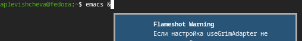{#fig-001 width=70%}

2. Создать файл lab11.sh с помощью комбинации Ctrl-x Ctrl-f (C-x C-f). ([рис. @fig-002]).

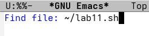{#fig-002 width=70%}

3. Наберите текст:([рис. @fig-003]).

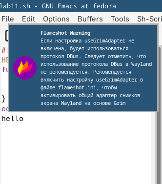{#fig-003 width=70%}

4. Сохранить файл с помощью комбинации Ctrl-x Ctrl-s (C-x C-s).([рис. @fig-004]).

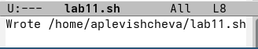{#fig-004 width=70%}

5. Проделать с текстом стандартные процедуры редактирования, каждое действие должно осуществляться комбинацией клавиш.

5.1. Вырезать одной командой целую строку (С-k)([рис. @fig-005]).

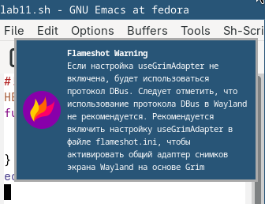{#fig-005 width=70%}

5.2. Вставить эту строку в конец файла (C-y).([рис. @fig-006]).

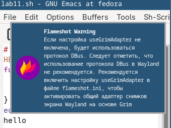{#fig-006 width=70%}

5.3. Выделить область текста (C-space).([рис. @fig-007]).

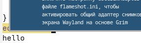{#fig-007 width=70%}

5.4. Скопировать область в буфер обмена (M-w).

5.5. Вставить область в конец файла.([рис. @fig-008]).

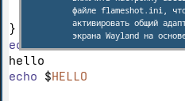{#fig-008 width=70%}

5.6. Вновь выделить эту область и на этот раз вырезать её (C-w).([рис. @fig-009]).

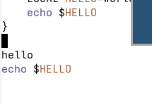{#fig-009 width=70%}

5.7. Отмените последнее действие (C-/).([рис. @fig-010]).

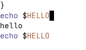{#fig-010 width=70%}

6. Научитесь использовать команды по перемещению курсора.

6.1. Переместите курсор в начало строки (C-a).([рис. @fig-011]).

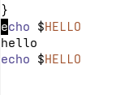{#fig-011 width=70%}

6.2. Переместите курсор в конец строки (C-e).([рис. @fig-012]).

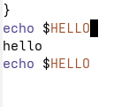{#fig-012 width=70%}

6.3. Переместите курсор в начало буфера (M-<).([рис. @fig-013]).

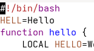{#fig-013 width=70%}

6.4. Переместите курсор в конец буфера (M->).([рис. @fig-014]).

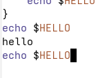{#fig-014 width=70%}

7. Управление буферами.

7.1. Вывести список активных буферов на экран (C-x C-b).([рис. @fig-015]).

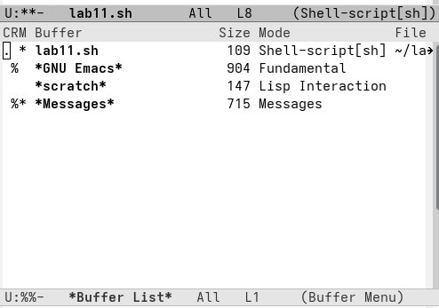{#fig-015 width=70%}

7.2. Переместитесь во вновь открытое окно (C-x) o со списком открытых буферов и переключитесь на другой буфер.([рис. @fig-016]).

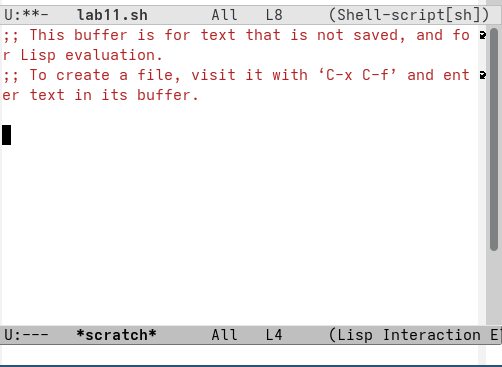{#fig-016 width=70%}

7.3. Закройте это окно (C-x 0).([рис. @fig-017]).

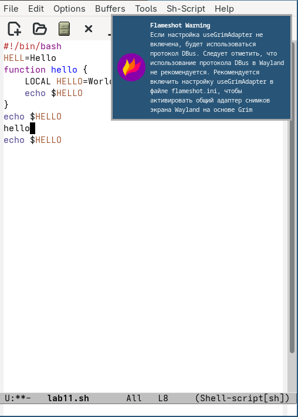{#fig-017 width=70%}

7.4. Теперь вновь переключайтесь между буферами, но уже без вывода их списка на экран (C-x b).([рис. @fig-018]).

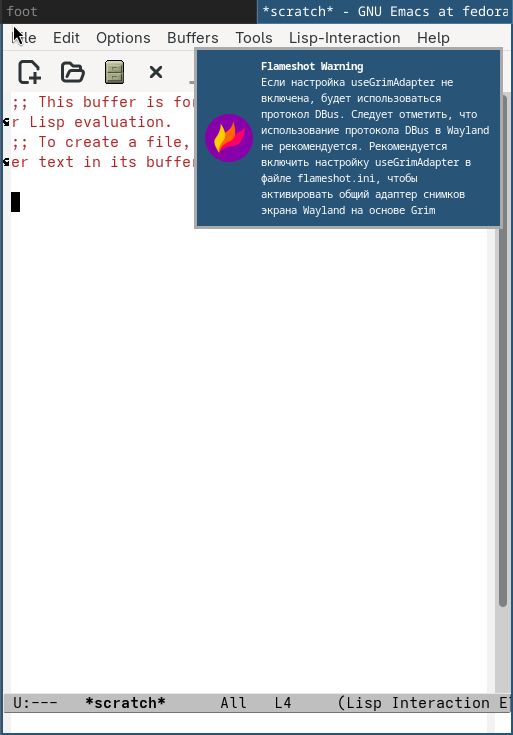{#fig-018 width=70%}

8. Управление окнами.

8.1. Поделите фрейм на 4 части: разделите фрейм на два окна по вертикали (C-x 3), а затем каждое из этих окон на две части по горизонтали (C-x 2).([рис. @fig-019]).

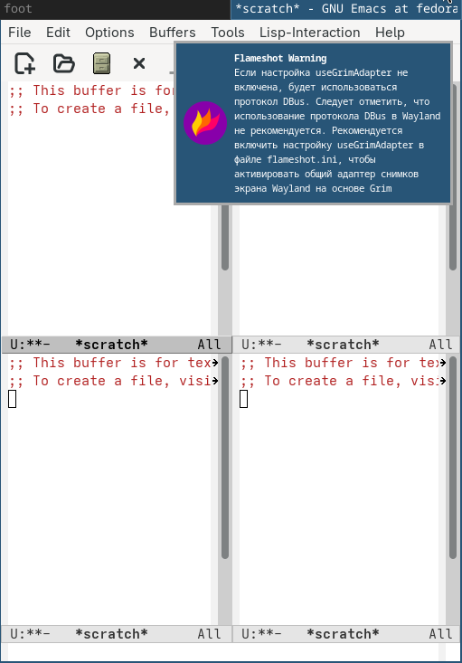{#fig-019 width=70%}

8.2. В каждом из четырёх созданных окон откройте новый буфер (файл) и введите несколько строк текста.([рис. @fig-020]).

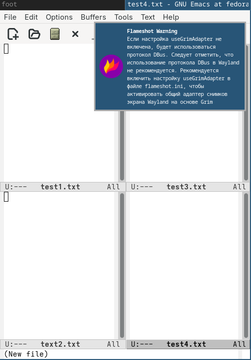{#fig-020 width=70%}

9. Режим поиска

9.1. Переключитесь в режим поиска (C-s) и найдите несколько слов, присутствующих в тексте.([рис. @fig-021]).

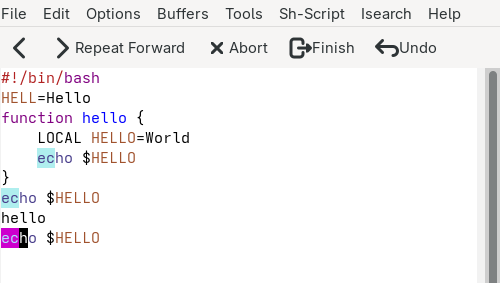{#fig-021 width=70%}

9.2. Переключайтесь между результатами поиска, нажимая C-s.([рис. @fig-022]).

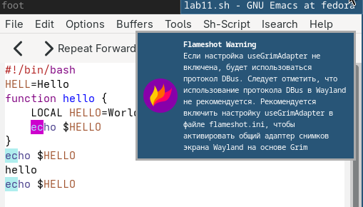{#fig-022 width=70%}

9.3. Выйдите из режима поиска, нажав C-g.([рис. @fig-023]).

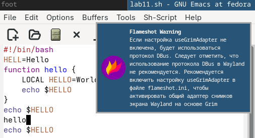{#fig-023 width=70%}

9.4. Перейдите в режим поиска и замены (M-%), введите текст, который следует найти и заменить, нажмите Enter , затем введите текст для замены. После того как будут подсвечены результаты поиска, нажмите ! для подтверждения замены.([рис. @fig-024]).

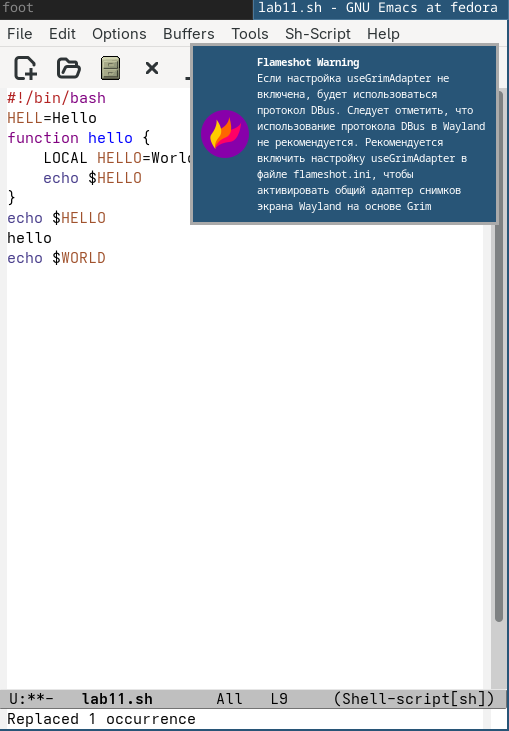{#fig-024 width=70%}

9.5. Испробуйте другой режим поиска, нажав M-s o. Объясните, чем он отличается от обычного режима?([рис. @fig-025]).

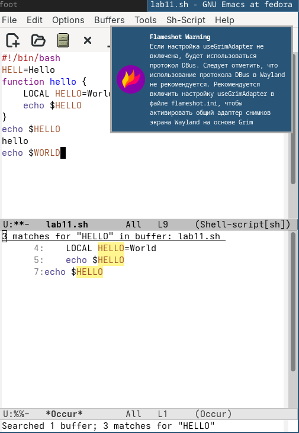{#fig-025 width=70%}

## Контрольные вопросы

1. Это мощный, расширяемый экранный текстовый редактор, написанный на Elisp. Его особенность — возможность работы без использования графического меню, в основном посредством комбинаций клавиш с префиксами Ctrl и Meta.

2. Обилие непривычных клавиатурных комбинаций (например, C-x C-c для выхода), использование минибуфера для ввода команд и концепция разделения на буферы, окна и фреймы, которые не сразу очевидны визуально.

3. Буфер — это объект в памяти, содержащий текст (файл, подсказки и т.д.). Окно — это видимая прямоугольная область на экране, которая отображает содержимое какого-либо одного буфера. Один буфер может отображаться в нескольких окнах.

4. Да, можно. Окно всегда отображает только один буфер в текущий момент, но общее количество одновременно открытых (активных) буферов в Emacs не ограничено десятью. Переключение между ними происходит через список буферов (C-x C-b).

5. При запуске без указания файла обычно создается буфер *scratch* (черновик для заметок) и буфер *Messages* (для системных сообщений).

6. Для C-c | нужно нажать и удерживать Ctrl, нажать c, отпустить Ctrl, затем нажать |.
   Для C-c C-| нужно нажать и удерживать Ctrl, нажать с, отпустить с (но продолжая держать Ctrl), затем нажать |.

7. По вертикали — C-x 2, по горизонтали — C-x 3.

8. В файле ~/.emacs или ~/.emacs.d/init.el в домашней директории пользователя.

9. По умолчанию в Emacs Tab (C-i) выполняет функцию отступов/выравнивания кода (indent-for-tab-command). Да, её (как и любую другую клавишу) можно переназначить, так как Emacs предоставляет полный контроль над раскладкой через скрипты на Elisp.

10. Мне показался удобнее Vi из-за простого модального управления командами, тогда как в Emacs нужно запоминать сложные многоклавишные сочетания с Alt и Ctrl, что замедляет работу при отсутствии навыка.

# Выводы

Я познакомилась с операционной системой Linux. Приобрела практические навыки работы с редактором Emacs.

