---
# Author
author:
  name: Levishcheva Anastasiya Petrovna
  degrees: DSc
  orcid: 0000-0002-0877-7063
  email: 1032252643@rudn.ru
  affiliation:
    - name: Российский университет дружбы народов
      country: Российская Федерация
      postal-code: 117198
      city: Москва
      address: ул. Миклухо-Маклая, д. 6

## Title
title: "Отчёт по блоку №1"
subtitle: "Архитектура компьютеров и операционные системы."
license: "Левищева Анастасия Петровна"
---

# Цель работы

Изучить основы работы с Linux.

# Задания

## 1.1.Как называется этот курс?

([рис. @fig-001]).

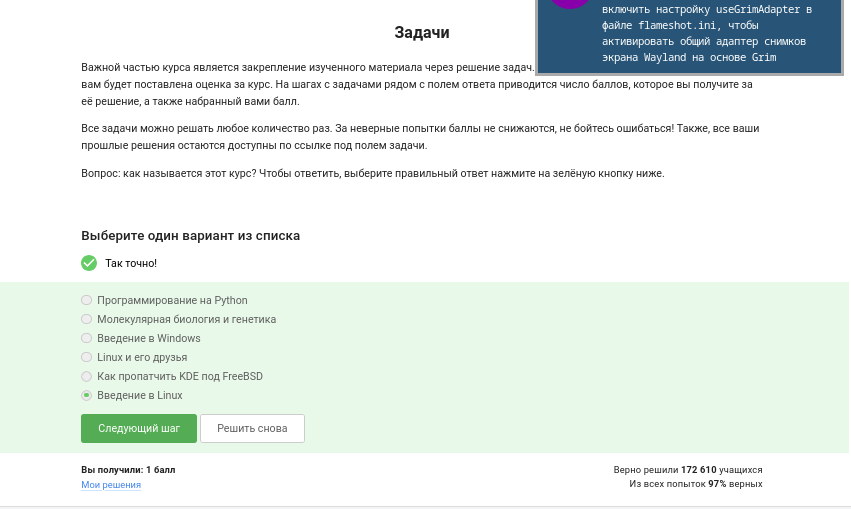{#fig-001 width=70%}

Пояснение: Правильный ответ — «Введение в Linux»

## 1.2.Критерии прохождения курса по Linux

([рис. @fig-002]).

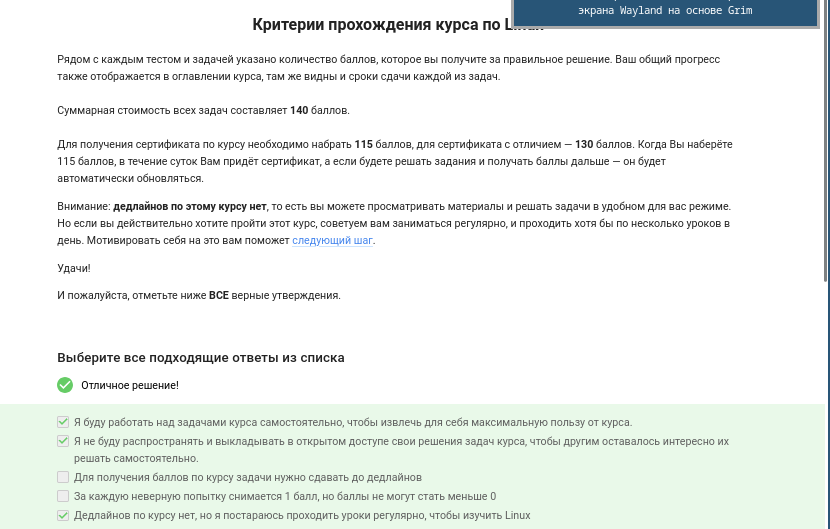{#fig-002 width=70%}

Пояснение: Рядом с каждым тестом и задачей указано количество баллов, которое вы получите за правильное решение. Для получения сертификата по курсу необходимо набрать 115 баллов, для сертификата с отличием — 130 баллов. Внимание: дедлайнов по этому курсу нет, то есть вы можете просматривать материалы и решать задачи в удобном для вас режиме. Но если вы действительно хотите пройти этот курс, советуем вам заниматься регулярно, и проходить хотя бы по несколько уроков в день.

Удачи!

## 2.1. Какую операционную систему вы обычно используете?

([рис. @fig-003]).

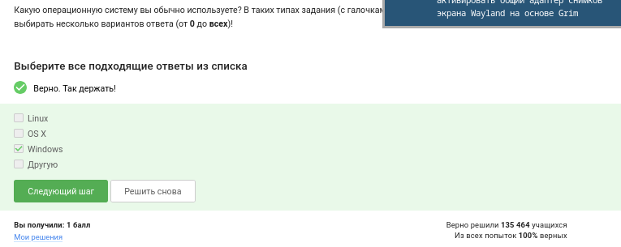{#fig-003 width=70%}

Пояснение: Ответ даётся на основе личного опыта, Windows.
 
## 2.2. Что такое виртуальная машина?

([рис. @fig-004]).

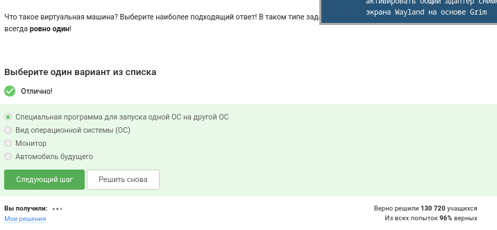{#fig-004 width=70%}

Пояснение: Виртуальная машина — это программная эмуляция физического компьютера, позволяющая запускать гостевую ОС внутри хостовой. Она изолирует ресурсы (CPU, память, диск) и позволяет безопасно тестировать и изучать другие системы.
 
## 2.3. Смогли ли вы запустить на своем компьютере Linux?

([рис. @fig-005]).

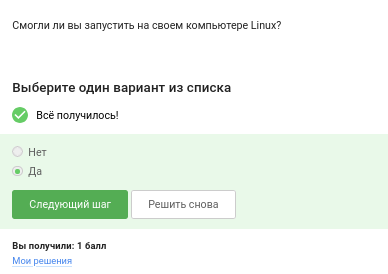{#fig-005 width=70%}

Пояснение: Задание проверяет практический результат. Если Linux запущен (нативно, в виртуальной машине или через WSL), выбирается «Да», иначе «Нет».
 
## 3.1. Создайте документ в OpenOffice/LibreOffice Writer (аналог Microsoft Word) и напишите в нём шрифтом FreeMono (если такого шрифта у вас нет, то используйте Arial или Times New Roman) одну-единственную строчку: Hello, Linux!
 
После этого сохраните этот документ в формате XML (Microsoft Word 2003 XML) или в формате FODT (OpenDocument Text: Flat XML) и загрузите в форму ниже.

([рис. @fig-006]).

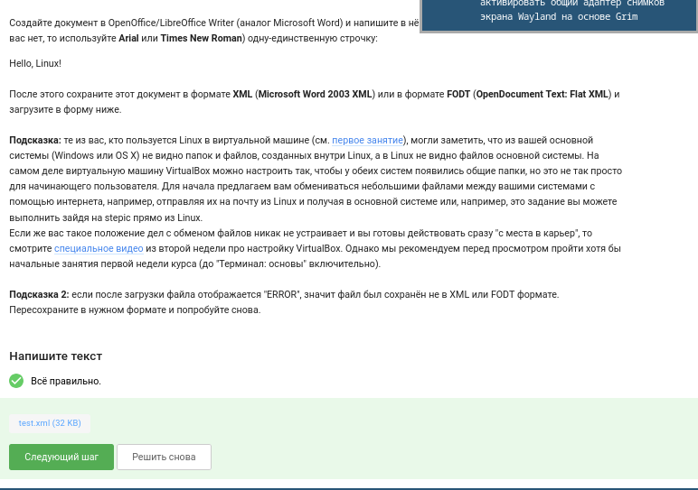{#fig-006 width=70%}

Пояснение: Практическое задание. Нужно открыть LibreOffice Writer, написать «Hello, Linux!» шрифтом FreeMono (или Arial/Times New Roman), затем сохранить в формате XML (Microsoft Word 2003 XML) или FODT и загрузить файл в форму.
 
## 3.2. Какое расширение имеют установочные пакеты в Linux (Ubuntu)?

([рис. @fig-007]).

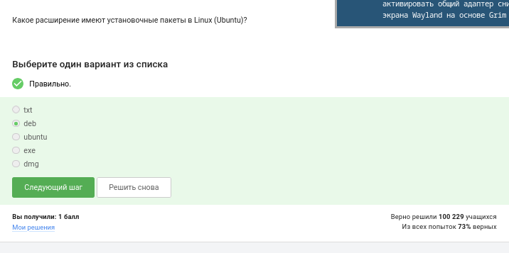{#fig-007 width=70%}

Пояснение: В Ubuntu используются пакеты с расширением .deb (Debian package). Это стандартный формат пакетов для Debian-основанных дистрибутивов.
 
## 3.3. Поставьте себе в систему плеер VLC (любым способом: через Software Center или скачиванием установочного пакета с сайта VLC). Запустите, откройте Help → About (или Shift+F1) и напишите ниже первую фамилию (без имени!) из вкладки Authors.

([рис. @fig-008]).

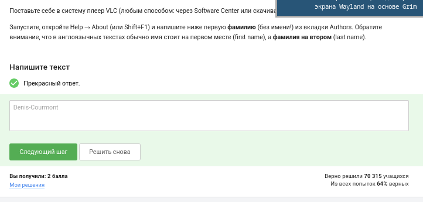{#fig-008 width=70%}

Пояснение: Практическое задание. После установки VLC (через Software Center или sudo apt install vlc) запускаем его, идём в Help → About → вкладка Authors. Первая фамилия в списке — Denis-Courmont.
 
## 3.4. Для чего можно использовать приложение Update Manager?

([рис. @fig-009]).

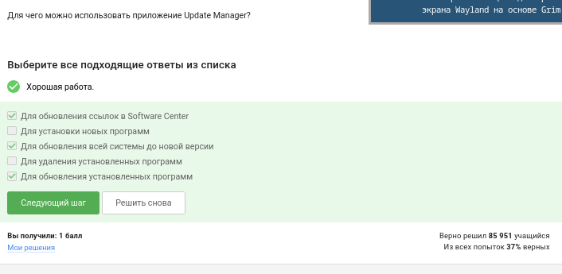{#fig-009 width=70%}

Пояснение: Update Manager предназначен для проверки, загрузки и установки обновлений системы и установленных пакетов. Он централизованно управляет обновлениями безопасности и новыми версиями программ.
 
## 4.1. Выберите все синонимы для “командной строки”.

([рис. @fig-010]).

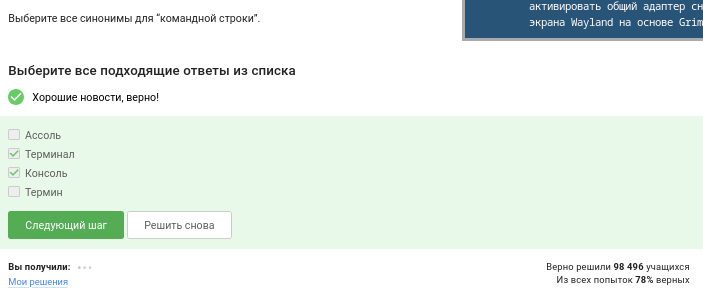{#fig-010 width=70%}

Пояснение: Синонимы: терминал, консоль, shell, command line, CLI. Выбираются все варианты, означающие интерфейс командной строки.
 
## 4.2. Какая команда напечатает в какой директории мы сейчас находимся?

([рис. @fig-011]).

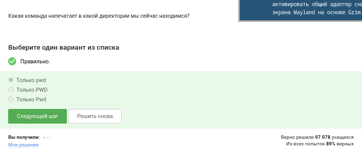{#fig-011 width=70%}

Пояснение: Команда pwd (print working directory) выводит абсолютный путь текущей директории.
 
## 4.3. Укажите, какие из следующих команд полностью эквивалентны команде ls -A --human-readable -l /some/directory

([рис. @fig-012]).

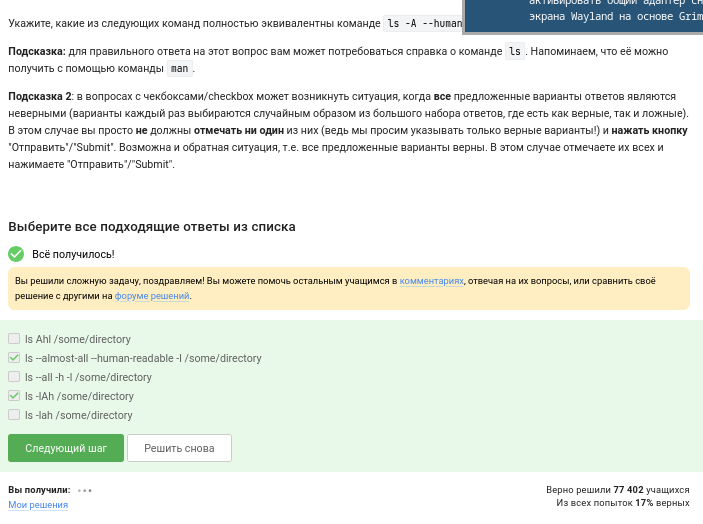{#fig-012 width=70%}

Пояснение: Полные эквиваленты — это те, где флаги могут быть записаны слитно или раздельно, в другом порядке, но дают ровно тот же вывод. Например, ls -lAh /some/directory, ls -l --all --human-readable /some/directory. Важно, что -A включает скрытые файлы, кроме . и .., -l — длинный формат, --human-readable — читаемые размеры.

## 4.4. Предположим, что вы находитесь в директории /home/bi/Documents, причем /home/bi — ваша домашняя директория. Какая(ие) команда выведет содержимое /home/bi/Downloads, при этом не показывая содержимое других директорий?

([рис. @fig-013]).

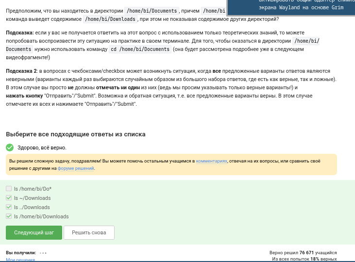{#fig-013 width=70%}

Пояснение: Из /home/bi/Documents корректная команда: ls /home/bi/Downloads. Вариант ls ~/Downloads тоже работает, если домашняя директория /home/bi. Команда ls Downloads выведет содержимое не той директории (если только нет локальной папки с таким именем).

## 4.5. Какая команда используется для удаления директорий?

([рис. @fig-014]).

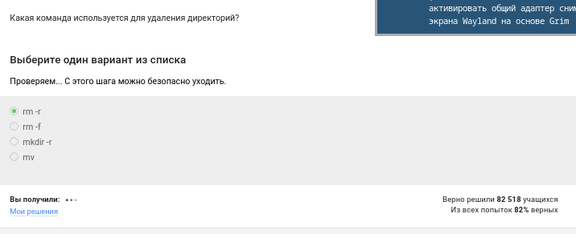{#fig-014 width=70%}

Пояснение: Используется rmdir (только для пустых) или rm -r (рекурсивное удаление).

## 5.1. Что произойдет, если ввести в терминал команду firefox (для запуска одноименного браузера), а затем ввести туда же команду exit?

([рис. @fig-015]).

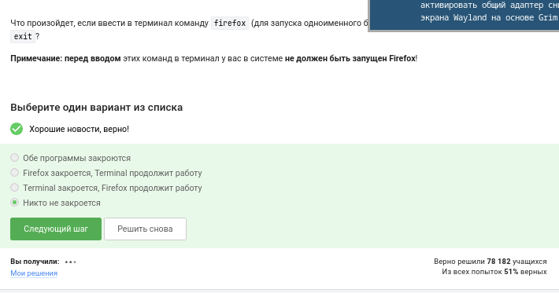{#fig-015 width=70%}

Пояснение: firefox запустит браузер в foreground-режиме, терминал будет занят. Команду exit ввести не получится, пока firefox не закроется, потому что shell ожидает завершения процесса. Если firefox запущен с &, тогда exit закроет терминал, а firefox продолжит работу.

## 5.2. Чему эквивалентен запуск программы с &?

([рис. @fig-016]).

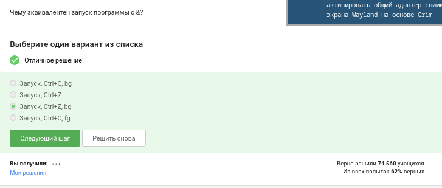{#fig-016 width=70%}

Пояснение: Запуск с & отправляет процесс в фоновый режим (background). Терминал остаётся доступным для ввода команд, а программа выполняется параллельно.

## 5.3. Скачайте файл с программой, сделайте его исполняемым, запустите и скопируйте то, что он выведет на экран, в форму ниже.

([рис. @fig-017]).

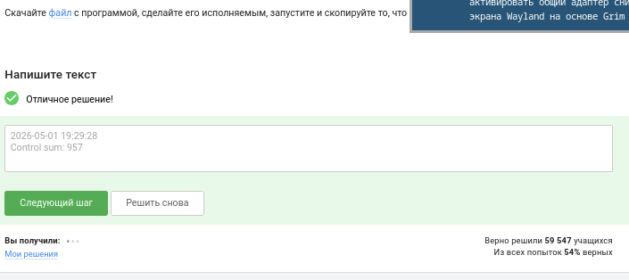{#fig-017 width=70%}

Пояснение: Практическое задание. Скачиваем файл, меняем права (chmod +x file), запускаем (./file), копируем вывод и вставляем в форму.

## 6.1. Куда по умолчанию выводится поток ошибок из программы, запущенной в терминале?

([рис. @fig-018]).

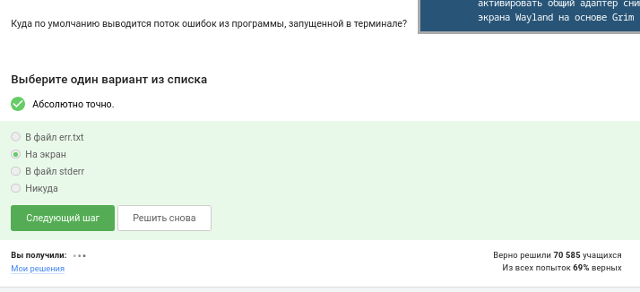{#fig-018 width=70%}

Пояснение: Поток ошибок (stderr) по умолчанию выводится на экран терминала (то есть в ту же консоль, куда и stdout). Оба потока отображаются в терминале, если не перенаправлены.

## 6.2. Какие (какая) из команд создадут файл file.txt и запишут в него поток ошибок программы program? Считайте, что в момент запуска программы файл file.txt не существует.

([рис. @fig-019]).

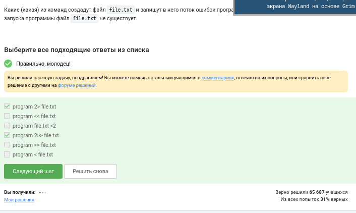{#fig-019 width=70%}

Пояснение: Правильный вариант: program 2> file.txt. Это перенаправит stderr в файл, создав его. Вариант program 2>&1 > file.txt может работать иначе: сначала stdout в файл, потом stderr туда же (если порядок правильный: program > file.txt 2>&1).

## 6.3. Куда деваются сообщения об ошибках (т.е. вывод в stderr) от тех программ, которые объединены в конвейер (pipe)?

([рис. @fig-020]).

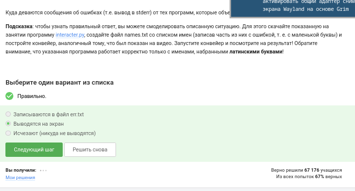{#fig-020 width=70%}

Пояснение: По умолчанию pipe (|) передаёт только stdout следующей команде. Stderr остаётся подключённым к терминалу и выводится на экран, не проходя через конвейер.

## 7.1. В каком файле на диске окажется картинка, если для её скачивания были выполнены следующие команды?

cd /home/alex/
wget -P /home/alex/Pictures -O 1.jpg http://example.com/example.jpg

([рис. @fig-021]).

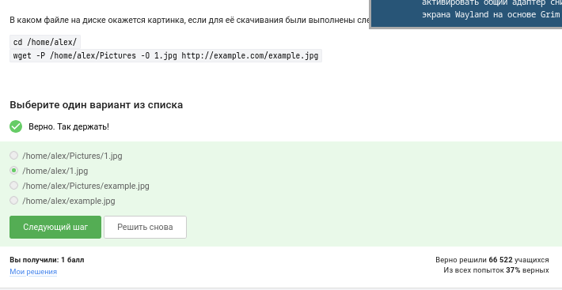{#fig-021 width=70%}

Пояснение: wget -P /home/alex/Pictures -O 1.jpg http://example.com/example.jpg сохранит файл как /home/alex/Pictures/1.jpg. Опция -P задаёт префикс директории, а -O — имя выходного файла.

## 7.2. Какую опцию нужно указать команде wget, чтобы она не выводила никаких сообщений на экран (Resolving.., Connecting to.. и т.д.)?

([рис. @fig-022]).

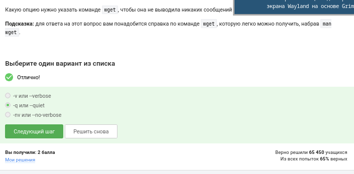{#fig-022 width=70%}

Пояснение: Опция -q (quiet) или --quiet отключает вывод прогресса и информационных сообщений.

## 7.3. Пусть на некоторой web-странице есть ссылки на картинки в форматах png и jpg, а также ссылки на другие страницы сайта (обычные html файлы). Какие файлы будут скачаны на компьютер, если запустить wget -r -l 1 -A jpg и передать в качестве аргумента ссылку на эту web-страницу?

([рис. @fig-023]).

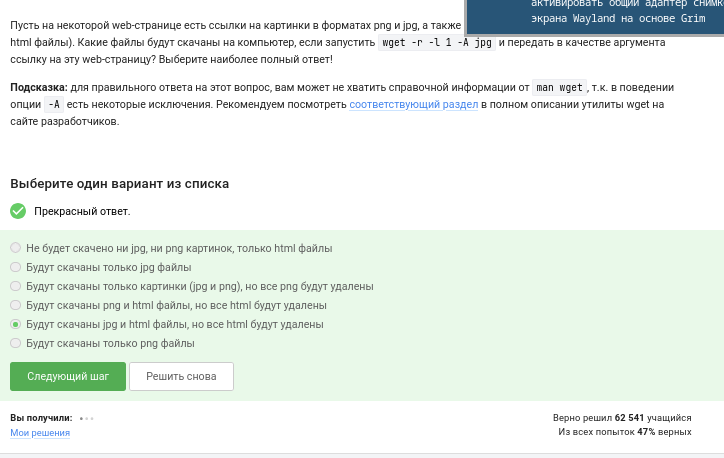{#fig-023 width=70%}

Пояснение: -r — рекурсивно, -l 1 — глубина 1 (только текущая страница и ссылки с неё), -A jpg — принимать только файлы с расширением .jpg. Будут скачаны jpg-картинки, на которые есть прямые ссылки на исходной странице. png и html проигнорируются из-за фильтра -A jpg.

## 8.1. Чем отличаются архиваторы gzip и zip?

([рис. @fig-024]).

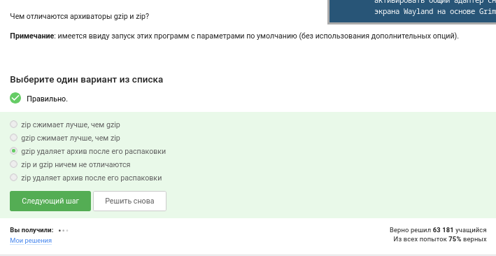{#fig-024 width=70%}

Пояснение: gzip сжимает только один файл (часто используется вместе с tar), не сохраняет структуру директорий и метаданные. zip — архиватор, упаковывающий несколько файлов/папок с сохранением структуры, может шифровать и разбивать на тома.

## 8.2. Какие из перечисленных программ-архиваторов могут создать архив из директории с файлами?

([рис. @fig-025]).

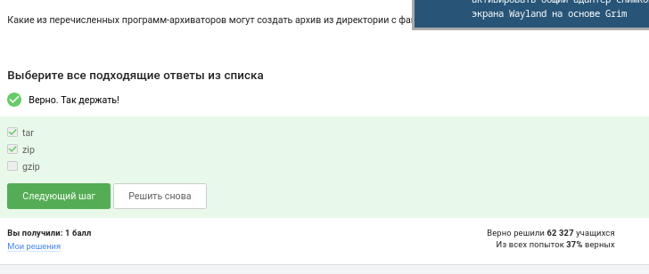{#fig-025 width=70%}

Пояснение: zip, tar (в комбинации с gzip/bzip2). gzip/bzip2 по отдельности не могут — они сжимают только отдельные файлы, поэтому сначала tar объединяет файлы в один поток, который потом сжимается.

## 8.3. Какой набор опций нужно указать программе tar, чтобы запаковать файлы в my_archive.tar.bz2?

([рис. @fig-026]).

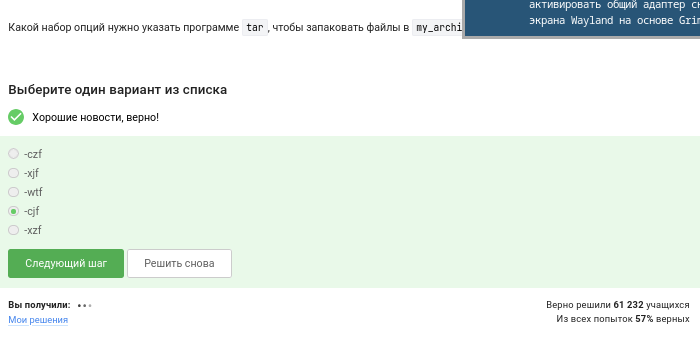{#fig-026 width=70%}

Пояснение: tar -cjf my_archive.tar.bz2 файлы_или_папки. -c — создать, -j — использовать bzip2, -f — указать имя архива.

## 9.1. Какая маска команды find НЕ найдет файл Alexey.jpeg?

([рис. @fig-027]).

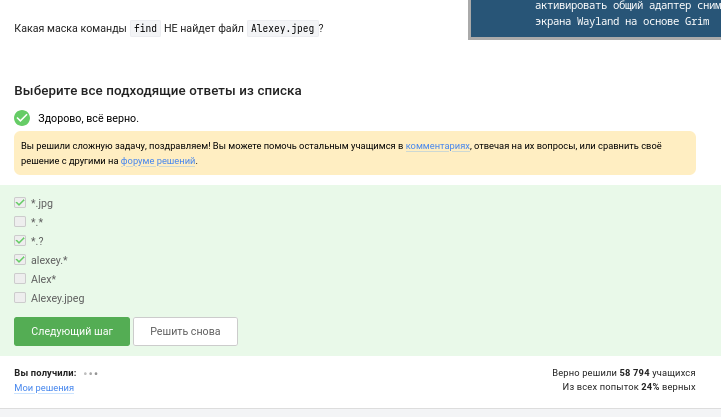{#fig-027 width=70%}

Пояснение: Например, маска *.jpg не найдёт, потому что расширение .jpeg не совпадает с .jpg. Также маска Alexey* может найти, если не учитывать расширение. Правильный ответ — та маска, которая не покрывает имя Alexey.jpeg.

## 9.2. Предположим, что в файле  text.txt записаны строки, показанные среди вариантов ответа. Отметьте только те из них, которые выведет на экран команда  grep "world" text.txt.

([рис. @fig-028]).

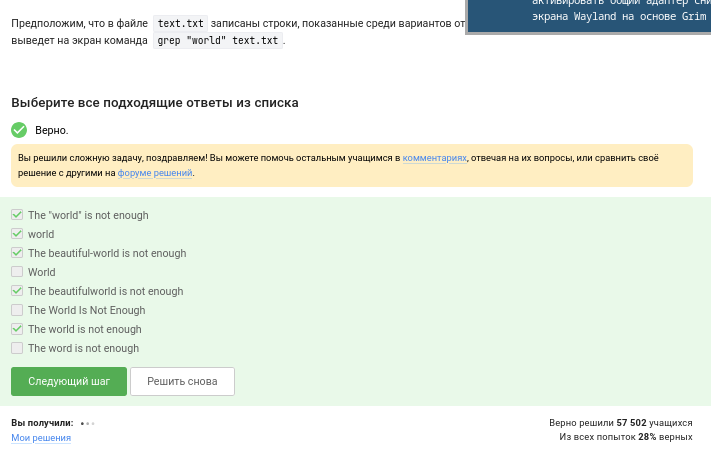{#fig-028 width=70%}

Пояснение: grep выводит строки, содержащие точное совпадение «world». Строки, где слово с другим регистром (World, WORLD) или являющееся частью другого слова, не подходят, если не указан -i. Выбираются только строки, где есть ровно «world» в любом месте строки.

## 9.3. ​​​​​​​Cкачайте архив с произведениями Шекспира. Вам нужно сгенерировать файл, в котором будут все строчки из этих произведений, содержащие “love”, и загрузить этот файл в форму.

([рис. @fig-029]).

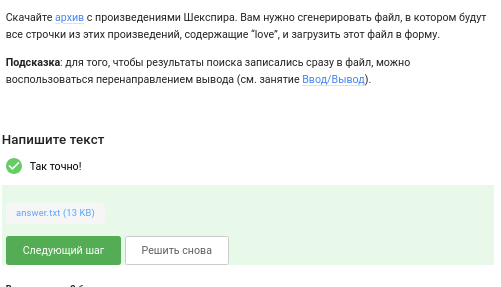{#fig-029 width=70%}

Пояснение: Практическое задание. Скачиваем архив, распаковываем, затем выполняем:
grep -i "love" * > love_lines.txt
или с рекурсивным поиском:
grep -ri "love" . > love_lines.txt
После этого загружаем полученный файл в форму. Перенаправление > записывает вывод сразу в файл.

# Выводы

Я изучила основы работы с Linux.

