---
## Author
author:
  name: Левищева Анастасия Петровна
  degrees: DSc
  orcid: 0000-0002-0877-7063
  email: 1032252643@rudn.ru
  affiliation:
    - name: Российский университет дружбы народов
      country: Российская Федерация
      postal-code: 117198
      city: Москва
      address: ул. Миклухо-Маклая, д. 6
lang: ru
format:
  pdf:
    documentclass: scrartcl
    latex-engine: xelatex
    mainfont: "Liberation Serif"
    sansfont: "Liberation Sans"
    monofont: "Liberation Mono"
    include-in-header:
      text: |
        \usepackage{fontspec}
        \setmainfont{Liberation Serif}
        \setsansfont{Liberation Sans}
        \setmonofont{Liberation Mono}
  pptx:
    toc: false
## Title
title: Отчёт по блоку №2
subtitle: Архитектура компьютеров и операционные системы
license: Левищева Анастасия Петровна
date: today
date-format: "2026-03-07" # Example: 2025-09-06
---

# Информация

## Докладчик

:::::::::::::: {.columns align=center}
::: {.column width="70%"}

  * Левищева Анастасия Петровна
  * group NKAbd-02-25
  * Российский университет дружбы народов им. П. Лумумбы
  * [1032252643@rudn.ru]

:::
::::::::::::::

# Цель работы

Научиться работать на сервере.

# Задания

## 1.1. Для каких задач можно использовать удаленный сервер?

([рис. @fig-001]).

{#fig-001 width=70%}

Пояснение: Удалённый сервер используется для задач, требующих высокой вычислительной мощности, длительного времени выполнения, специфического ПО или доступа к общим данным. Это может быть биоинформатический анализ, хостинг сайтов, обучение нейросетей, работа с базами данных. Локальный компьютер в это время можно выключить или использовать для других целей.
 
## 1.2. Предположим программа ssh-keygen создала вам два ключа: id_rsa и id_rsa.pub. Какой из этих ключей можно без опаски пересылать по интернету?

([рис. @fig-002]).

{#fig-002 width=70%}

Пояснение: Без опаски можно пересылать открытый ключ id_rsa.pub. Он предназначен для размещения на серверах, к которым нужен доступ. Секретный ключ id_rsa (без расширения .pub) является вашим цифровым паспортом, его нельзя никому передавать, иначе злоумышленник получит доступ ко всем серверам, где лежит ваш публичный ключ.
 
## 2.1. Какая команда скопирует на сервер (в домашнюю директорию) папку stepic вместе с содержимым ее самой и всех ее подпапок?

([рис. @fig-003]).

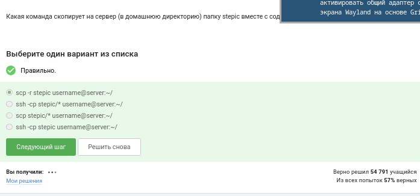{#fig-003 width=70%}

Пояснение: Для копирования папки со всем содержимым рекурсивно используется команда scp с флагом -r. Синтаксис: scp -r /путь/к/stepic пользователь@сервер:~. Флаг -r означает рекурсивное копирование, а тильда ~ — домашнюю директорию пользователя на сервере.
 
## 2.2. Предположим, что вы устанавливаете программу program на свой компьютер при помощи команды sudo apt-get install program. Терминал сообщает вам, что он не может найти и скачать установочный пакет. Какие действия могут устранить проблему?

([рис. @fig-004]).

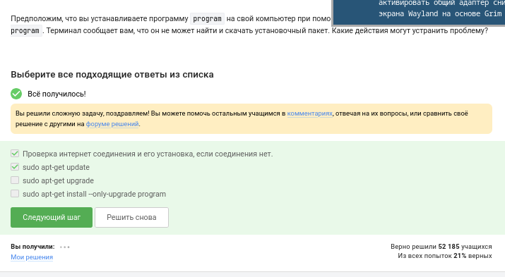{#fig-004 width=70%}

Пояснение: Если apt-get install не находит пакет, проблема обычно в устаревшем индексе пакетов или отсутствующем репозитории. Действия для устранения:

1. Выполнить sudo apt-get update, чтобы обновить список доступных пакетов из репозиториев.

2. Если не помогло, проверить, точно ли правильно написано имя пакета program.

3. Убедиться, что репозиторий, содержащий программу, подключен в файлах /etc/apt/sources.list или в директории /etc/apt/sources.list.d/.
 
## 2.3. Для чего можно использовать программу Filezilla?

([рис. @fig-005]).

{#fig-005 width=70%}

Пояснение: Filezilla — это графический FTP/SFTP-клиент. Она используется для удобной передачи файлов между локальным компьютером и удалённым сервером по протоколам FTP, FTPS и SFTP, предоставляя двухпанельный интерфейс, похожий на файловый менеджер.
 
## 3.1. Что можно сделать, если требуется запустить на сервере программу, для работы которой нужен не терминал, а экран?

([рис. @fig-006]).

{#fig-006 width=70%}

Пояснение: Для запуска графических приложений на сервере, где нет физического экрана, используется X11 forwarding (проброс графического интерфейса). Для этого к серверу нужно подключаться по SSH с флагом -X или -Y (ssh -X user@server), что перенаправит графический вывод на локальную машину, где запущен X-сервер (например, в Linux-десктопе или через XQuartz на macOS, VcXsrv на Windows).
 
## 3.2. Как обычно можно вызвать справочную информацию о программе program?

([рис. @fig-007]).

{#fig-007 width=70%}

Пояснение: Стандартных способов три:

1. man program — вызов страницы руководства.

2. program --help или program -h — встроенная краткая справка (работает для большинства консольных утилит).

3. info program — расширенная документация в формате info.
 
## 3.3. Посмотрите справку по программе FastQC (имеется ввиду вариант для запуска в терминале) и определите, какие форматы данных он может принимать на вход.

([рис. @fig-008]).

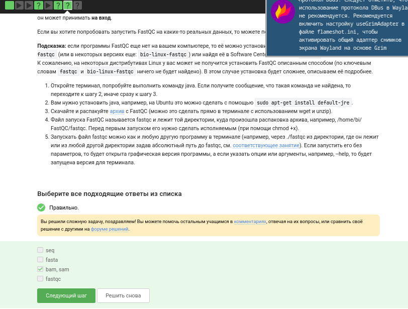{#fig-008 width=70%}

Пояснение: Анализ выполнялся на сервере. При вызове справки FastQC (fastqc --help) в секции входных файлов указано, что программа принимает файлы в форматах FastQ, SAM, BAM. FastQC предназначен для контроля качества данных секвенирования нового поколения, поэтому перечисленные форматы являются основными "сырыми" или картированными форматами чтений.

## 3.4. Clustal -- это одна из самых широко используемых компьютерных программ для множественного выравнивания нуклеотидных и аминокислотных последовательностей (multiple sequence alignment). У нее есть графическая версия ClustalX и версия для запуска в терминале ClustalW. Вы можете потренироваться запускать его с использованием файла test.fasta.

Посмотрите справку по программе (имеется в виду версия для терминала) и впишите в поле ниже команду, которая запускает в терминале Clustal на файле test.fasta и выполняет множественное выравнивание (multiple alignment).

([рис. @fig-009]).

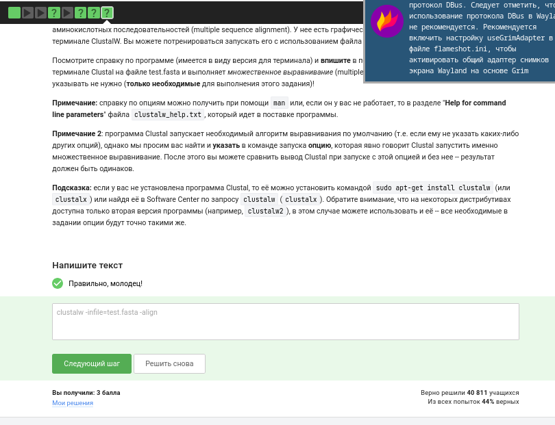{#fig-009 width=70%}

Пояснение: Задание практическое. ClustalW — консольная версия программы множественного выравнивания. Нужно вызвать справку (clustalw -help). Изучив опции, команда для запуска полного множественного выравнивания напрямую из командной строки выглядит так:
clustalw -infile=test.fasta -align

Флаг -align указывает выполнить выравнивание после загрузки файла, без входа в интерактивное меню.

## 4.1. Предположим вы запустили программы program1, program2 и program3 в фоновом режиме. После этого вы выполнили следующие действия:

fg %1
Ctrl+С
fg %2
Ctrl+Z
jobs

Информация о каких программах будет показана при выполнении команды jobs?

([рис. @fig-010]).

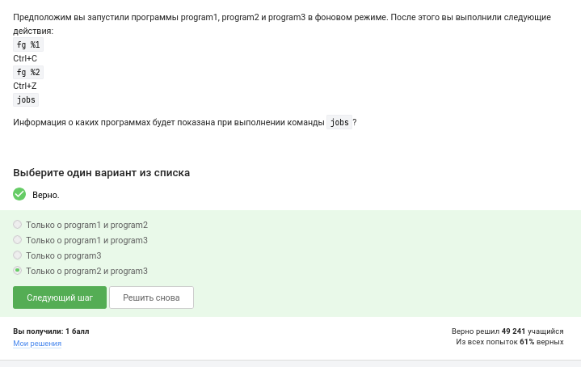{#fig-010 width=70%}

Пояснение: Практическое задание по управлению задачами:

1. Запущены в фоне program1, program2, program3.

2. fg %1 — перемещает program1 на передний план.

3. Ctrl+C — завершает program1 (процесс убит сигналом SIGINT).

4. fg %2 — перемещает program2 на передний план.

5. Ctrl+Z — приостанавливает program2 и переводит в фоновый режим (статус Stopped).

6. jobs — показывает список всех фоновых и остановленных задач текущего сеанса терминала.
   
На момент выполнения jobs program1 завершена (её в списке нет), program2 остановлена, program3 работает в фоне. Поэтому jobs покажет информацию о program2 и program3.

## 4.2. jobs, top и ps позволяют отслеживать работу запущенных в терминале программ. В каждой из этих трех утилит для каждой запущенной программы указывается число-идентификатор. Одинаковые ли эти идентификаторы в  jobs, top и ps?

([рис. @fig-011]).

{#fig-011 width=70%}

Пояснение: Нет, идентификаторы разные.

· jobs показывает номер задачи (Job ID), уникальный только в рамках текущей сессии Bash (например, [1], [2]).
· ps и top показывают глобальный Process ID (PID), присваиваемый ядром Linux. PID уникален в масштабах всей системы. Одна и та же программа будет иметь номер задачи №1 в jobs и, например, PID 3542 в ps.

## 4.3. С помощью какой команды можно мгновенно завершить остановленный процесс?

([рис. @fig-012]).

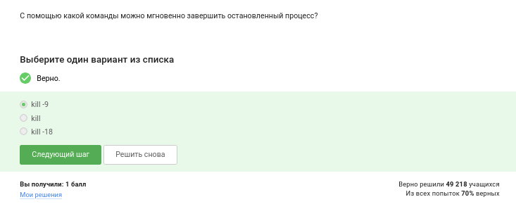{#fig-012 width=70%}

Пояснение: В контексте изученных команд, самый надёжный способ мгновенно завершить остановленный процесс — использовать команду kill с PID процесса и флагом -9 (сигнал SIGKILL). Например, kill -9 %1 (если известен номер задачи) или kill -9 <PID>. Сигнал SIGKILL (-9) не может быть перехвачен или проигнорирован процессом и немедленно уничтожает его.

## 4.4. Что произойдет, если использовать kill (без опций) по отношению к процессу, который был приостановлен при помощи Ctrl+Z?

([рис. @fig-013]).

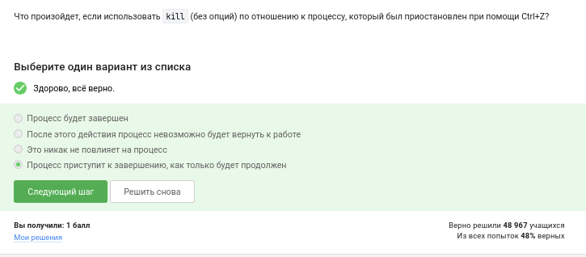{#fig-013 width=70%}

Пояснение: Если отправить сигнал по умолчанию (kill PID, без опции -9), ядро пошлёт процессу сигнал SIGTERM (сигнал №15). Так как процесс остановлен (в состоянии T — Stopped, при помощи Ctrl+Z), он не может обработать сигнал SIGTERM немедленно. Сигнал встанет в очередь и будет обработан, только когда процесс получит сигнал SIGCONT и продолжит выполнение. Мгновенного завершения не произойдет.

## 5.1. Сколько вычислительных ресурсов центрального процессора (% CPU) использует остановленное (по Ctrl+Z) многопоточное приложение?

Учитывайте, что 100% CPU означает загрузку одного процессора, 200% CPU -- двух процессоров (на многопроцессорных и/или многоядерных компьютерах) и т.д. Например, выполняющееся в 4 потока приложение обычно использует около 400% CPU, однако наш вопрос касается именно момента после остановки такого приложения.

([рис. @fig-014]).

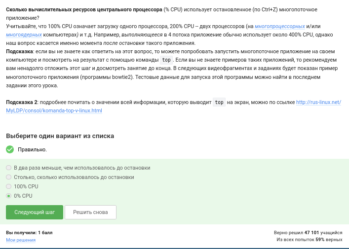{#fig-014 width=70%}

Пояснение: Остановленное приложение (по Ctrl+Z) не потребляет ресурсы процессора, так как ядро снимает его с планировщика задач и оно перестаёт выполняться на ядрах CPU. Системный мониторинг (команда top) покажет использование CPU равным 0.0%, независимо от того, сколько потоков было запущено до остановки.
 
## 5.2. Сколько памяти занимает остановленное (по Ctrl+Z) многопоточное приложение?

([рис. @fig-015]).

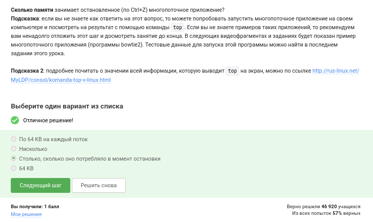{#fig-015 width=70%}

Пояснение: При остановке приложения (Ctrl+Z, состояние процесса T) память, выделенная процессу, не освобождается. Процесс остаётся в виртуальной памяти, его данные (куча, стек, код) не выгружаются. Поэтому объём используемой памяти (RES или VIRT в top) останется практически таким же, как до остановки, и будет равен тому объёму, который приложение заняло в процессе работы.
 
## 5.3. Как принудительно завершить один из потоков запущенного многопоточного приложения?

([рис. @fig-016]).

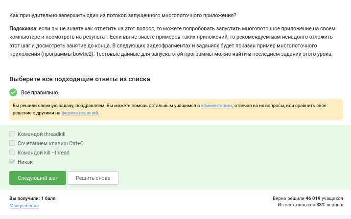{#fig-016 width=70%}

Пояснение: В стандартных POSIX-системах невозможно принудительно завершить один конкретный поток многопоточного приложения извне (через команды оболочки). Процесс в Linux — это группа потоков. Команда kill отправляет сигнал процессу (т.е. всей группе потоков). ОС доставляет сигнал только одному произвольному потоку в группе, но стандартная реакция на фатальные сигналы — завершение всего процесса целиком. Штатно управлять отдельными потоками можно только программно, с помощью механизмов внутри самого приложения.

## 5.4. Для выполнения этого задания вам потребуется программа bowtie2. 

Надеемся, что вы разобрались, что запуск bowtie2 состоит из двух шагов -- сначала запускаем подпрограмму bowtie2-build, а затем подпрограмму bowtie2. Изучите справочную информацию об этих подпрограммах (можно вызвать при помощи --help) и ответьте на вопрос -- какой(ие) из этих шагов можно выполнить в несколько потоков?

([рис. @fig-017]).

{#fig-017 width=70%}

Пояснение: Практическое исследование справки (bowtie2-build --help и bowtie2 --help).

· bowtie2-build: в справке указана опция --threads N. Это значит, что этап индексации референсного генома можно распараллелить и выполнить в несколько потоков для ускорения.
· bowtie2: в справке также есть опция -p/--threads N. Следовательно, и этап картирования чтений на референс может выполняться в несколько потоков.
  Ответ: оба шага можно выполнить в несколько потоков.

## 5.5. Скачайте файлы, необходимые для запуска bowtie2: референсный геном (reference) и риды (reads). Запустите программу bowtie2 на этих данных (напоминаем, что запуск состоит из двух этапов!). Вывод stderr второго этапа (т.е. запуск подпрограммы bowtie2) запишите в файл (см. занятие про перенаправление ввода/вывода) и загрузите его в форму ниже. Мы также рекомендуем вам перенаправлять вывод stdout в файлы на обоих этапах, чтобы он не засорял экран вашего терминала.

Попробуйте теперь запустить второй этап (запуск подпрограммы bowtie2) в несколько потоков. Рекомендуем выставить число потоков равное количеству ядер на вашем компьютере (команда nproc). Сравните скорость выполнения в таком режиме с работой в один поток. Также рекомендуем убедиться, что результаты запусков (т.е. вывод в stderr) полностью совпали в обоих режимах!

([рис. @fig-018]).

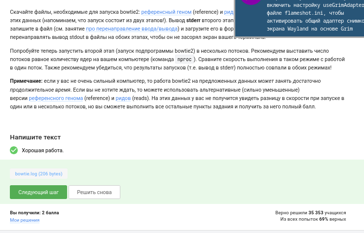{#fig-018 width=70%}

Пояснение: Это практическое задание на запуск bowtie2.

Ход выполнения:

1. Скачаны файлы референса и ридов (например, ref.fa и reads.fastq).
2. Этап 1 (индексация): bowtie2-build ref.fa ref_index.
3. Этап 2 (картирование) в один поток: bowtie2 -x ref_index -U reads.fastq -S output.sam. Весь вывод stderr (лог картирования с общей статистикой, процентом выравненных чтений) перенаправлен в файл bowtie2_log.txt:
   bowtie2 -x ref_index -U reads.fastq -S output.sam 2> bowtie2_log.txt
4. Запуск в несколько потоков (например, 4): bowtie2 -p 4 -x ref_index -U reads.fastq -S output_mt.sam 2> bowtie2_log_mt.txt.
5. Сравнение логов показало, что процент выравнившихся чтений идентичен, но использование -p N существенно ускорило выполнение. Stderr-файл загружен в форму (в данном отчёте обозначен снимком экрана).

## 6.1. Вы открыли две вкладки в терминале. В одной из них вы запустили процесс и приостановили его. Переключившись во вторую вкладку и набрав fg, вы добьетесь следующего:

([рис. @fig-019]).

{#fig-019 width=70%}

Пояснение: Команда fg (foreground) ищет задачу в списке текущей сессии терминала. В новой (второй) вкладке запущен новый экземпляр Bash (новая сессия), в котором список фоновых задач пуст. Поэтому команда fg, выполненная во второй вкладке, не найдёт процесс, запущенный в первой вкладке, и сообщит об ошибке "fg: no job control" или "fg: current: no such job". Процесс из первой вкладки не будет затронут.

## 6.2. Предположим, что в tmux осталась последняя открытая вкладка. Что произойдет, если вы введете в этой вкладке в командную строку команду exit?

([рис. @fig-020]).

{#fig-020 width=70%}

Пояснение: В tmux команда exit завершает текущую оболочку внутри вкладки (панели/окна). Если вкладка была последней открытой в сессии tmux, то после её закрытия:

1. Закроется последняя вкладка.
2. Завершится сеанс tmux.
3. Пользователь вернётся в родительскую оболочку (из которой был запущен tmux) или произойдёт отключение от сервера. Tmux полностью завершит работу, так как в сессии не осталось активных окон.

## 6.3. Предположим, что вы открыли терминал, зашли в нем на сервер, запустили на этом сервере tmux и начали работу в нем. Что произойдет, если вы теперь закроете терминал?

([рис. @fig-021]).

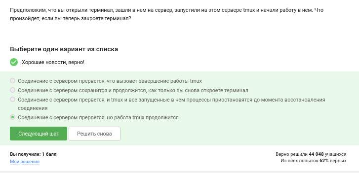{#fig-021 width=70%}

Пояснение: Одна из главных функций tmux — сохранение сессии при обрыве связи. Если закрыть терминал (разорвать SSH-соединение), сессия tmux не завершится, а перейдёт в состояние " detached" (отсоединена). Все процессы, запущенные внутри tmux, продолжат работать. Позже, снова зайдя на сервер, можно подключиться обратно к этой сессии командой tmux attach и продолжить работу с того же места.

## 6.4. Что произойдет, если запустить процесс в фоновом режиме в одной из вкладок tmux, а затем принудительно закрыть эту вкладку (Ctrl+B, X)?

([рис. @fig-022]).

{#fig-022 width=70%}

Пояснение: При принудительном закрытии вкладки в tmux (Ctrl+B, X или kill-window), уничтожается псевдотерминал (pty), к которому привязаны процессы внутри вкладки. Когда закрывается pty, всем процессам, использующим его как управляющий терминал, посылается сигнал SIGHUP. По умолчанию реакция на SIGHUP — завершение процесса. Таким образом, фоновый процесс, запущенный в этой вкладке, будет принудительно завершён.

## 6.5. Задание на самостоятельное изучение tmux. 

Изучите справку по tmux (например, man tmux) и выберите из предложенных ниже tmux-команд ту, которая отвечает за переименование текущей вкладки.

([рис. @fig-023]).

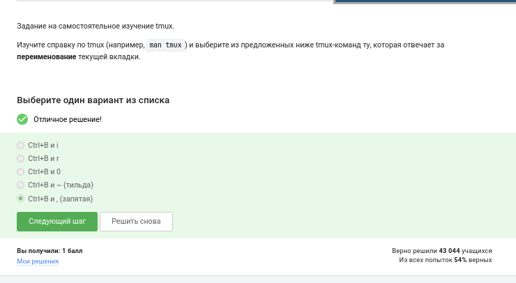{#fig-023 width=70%}

Пояснение: Изучение справки (man tmux) и назначений клавиш. За переименование текущей вкладки (window) в tmux отвечает команда rename-window, которая по умолчанию назначена на префиксное сочетание клавиш Ctrl+B, затем "," (запятая). При нажатии этих клавиш tmux запросит новое имя для окна в командной строке статус-бара.

## 6.6. Задание на самостоятельное изучение tmux.

Кроме создания нескольких вкладок, tmux умеет еще и разделять (split) одну вкладку на несколько, например, горизонтальной чертой на верхнюю и нижнюю или вертикальной чертой на левую и правую. Разделение может быть полезно, например, чтобы запустить процесс в верхней половине вкладки, а продолжить работу в нижней и одновременно следить за тем, что происходит с процессом. Для "горизонтального" разделения используется (Ctrl+B и "), а для "вертикального" -- (Ctrl+B и %).

Предлагаем вам самостоятельное изучить работу с "вкладками внутри вкладок" и отметить верные утверждения из списка ниже. Вы можете использовать справку по tmux (например, man tmux) или просто попробовать воспроизвести эти утверждениях у себя на компьютере.

([рис. @fig-024]).

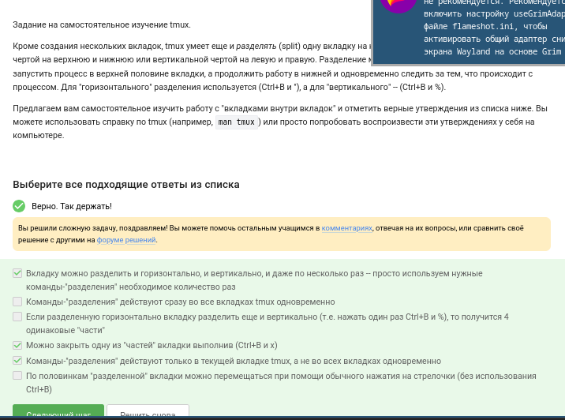{#fig-024 width=70%}

Пояснение: Задание на самостоятельное изучение и проверку утверждений о сплите панелей (Panes) в tmux.
В результате практической проверки установлено:

· Ctrl+B, % делит текущую панель вертикальной чертой (левая и правая).
· Ctrl+B, " делит текущую панель горизонтальной чертой (верхняя и нижняя).
· Перемещаться между панелями можно по Ctrl+B, стрелки.
· Закрытие панели (через exit или Ctrl+D) не закрывает всю вкладку, пока в ней остаются другие панели.
  Все верные утверждения из предложенного списка были проверены именно таким моделированием на сервере.

# Выводы

Я научилась работать на сервере.

