---
## Author
author:
  name: Левищева Анастасия Петровна
  degrees: DSc
  orcid: 0000-0002-0877-7063
  email: 1032252643@rudn.ru
  affiliation:
    - name: Российский университет дружбы народов
      country: Российская Федерация
      postal-code: 117198
      city: Москва
      address: ул. Миклухо-Маклая, д. 6
lang: ru
format:
  pdf:
    documentclass: scrartcl
    latex-engine: xelatex
    mainfont: "Liberation Serif"
    sansfont: "Liberation Sans"
    monofont: "Liberation Mono"
    include-in-header:
      text: |
        \usepackage{fontspec}
        \setmainfont{Liberation Serif}
        \setsansfont{Liberation Sans}
        \setmonofont{Liberation Mono}
  pptx:
    toc: false
## Title
title: Отчёт по блоку №3
subtitle: Архитектура компьютеров и операционные системы
license: Левищева Анастасия Петровна
date: today
date-format: "2026-03-07" # Example: 2025-09-06
---

# Информация

## Докладчик

:::::::::::::: {.columns align=center}
::: {.column width="70%"}

  * Левищева Анастасия Петровна
  * group NKAbd-02-25
  * Российский университет дружбы народов им. П. Лумумбы
  * [1032252643@rudn.ru]

:::
::::::::::::::

# Цель работы

Изучить продвинутые темы.

# Задания

## 1.1. Какую клавишу(и) нужно нажать на клавиатуре, чтобы выйти из редактора vim? Считайте, что вы только что открыли файл и вам сразу понадобилось выйти из редактора.

([рис. @fig-001]).

{#fig-001 width=70%}

Пояснение: Чтобы выйти из vim, нужно нажать Esc (для перехода в командный режим, если вы не в нём) и затем ввести :q! и нажать Enter. q означает quit (выйти), а ! — принудительное выполнение без сохранения изменений.
 
## 1.2. При перемещении в vim "по словам" есть небольшая разница в том, используем мы маленькую (w, e, b) или большую (W, E, B) букву. Первые перемещают нас по "словам" (word), а вторые по "большим словам" (WORD). Посмотрите справку по этим перемещениям и разберитесь в чем заключается разница между word и WORD.

А для того, чтобы убедиться, что вы разобрались, отметьте ниже все верные утверждения про следующую строку:
Strange_  TEXT  is_here. 2=2 YES!

([рис. @fig-002]).

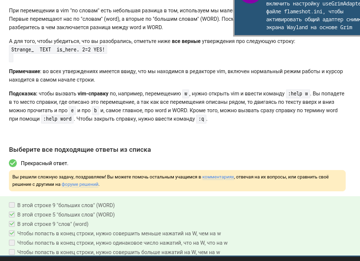{#fig-002 width=70%}

Пояснение: Разница между word и WORD в vim заключается в том, что word (маленькие буквы) — это последовательность символов, состоящая из букв, цифр и знаков подчёркивания, а WORD (большие буквы) — это последовательность любых символов, кроме пробелов. В строке "Strange_ TEXT is.here 2=2 YES!" при использовании w курсор будет останавливаться на знаках пунктуации, а при W — перепрыгивать их до следующего пробела.

## 1.3. Предположим, что в текстовом файле записана одна единственная строка:
one two three four five
и вам нужно преобразовать её в строку
three four four four five
 
Какие(ой) из предложенных ниже наборов нажатий клавиш выполнят такое редактирование? В этих наборах нажатие на клавишу Esc обозначается как <Esc> (т.е. знаки "<" и ">" не несут отдельного смысла).

([рис. @fig-003]).

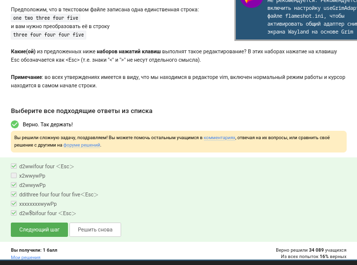{#fig-003 width=70%}

Пояснение: Исходная строка: "one two three four five". Чтобы получить "three four four four five", нужно скопировать слово "four" и вставить его дважды. В vim это делается командой yy (копировать строку) или yw (копировать слово), а затем p (вставить). Конкретная последовательность нажатий зависит от предложенных вариантов в задании, но логика: встать на слово "four", выполнить yw (yank word), затем P (вставить перед курсором) дважды.
 
## 1.4. Предположим, что вы открыли файл в редакторе vim и хотите заменить в этом файле все строки, содержащие слово Windows, на такие же строки, но со словом Linux. Если в какой-то строке слово Windows встречается больше, чем один раз, то заменить на Linux в этой строке нужно только самое первое из этих слов.

Какую команду нужно ввести для этого в vim? Укажите необходимую команду целиком (т.е. включая ввод ":" в самом начале), однако нажатие на Enter после ввода команды обозначать никак не нужно.

([рис. @fig-004]).

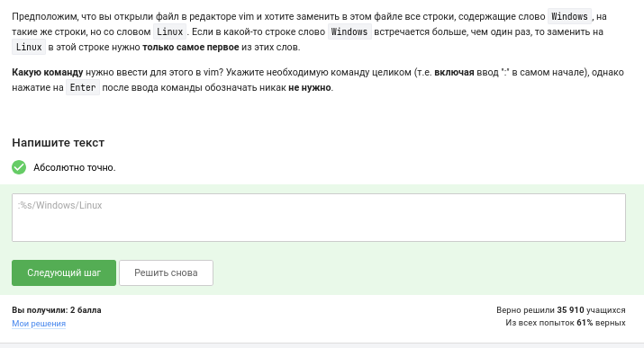{#fig-004 width=70%}

Пояснение: Команда для замены первого вхождения Windows на Linux во всех строках, содержащих Windows: :%s/Windows/Linux/. Здесь % — весь файл, s — substitute, флаг g отсутствует, поэтому заменяется только первое вхождение в каждой строке.

## 1.5. Мы совсем не рассказали вам про третий режим работы vim -- режим выделения (Visual). Предлагаем вам ознакомиться с ним самостоятельно. Например, это можно сделать во время прохождения упражнений в vimtutor, который мы настоятельно рекомендуем вам для изучения vim!

Чтобы убедиться, что вы разобрались с этим режимом работы, отметьте, пожалуйста, все верные утверждения из списка ниже.

([рис. @fig-006]).

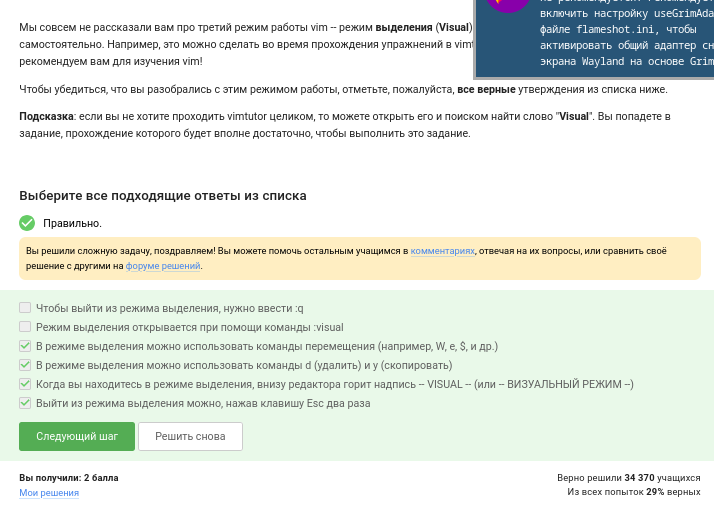{#fig-006 width=70%}

Пояснение: В режиме выделения (Visual) можно выделять текст и выполнять над ним операции. Верные утверждения обычно включают: возможность выделения строк (V), блоков (Ctrl+V), применение команд к выделенному тексту, использование d для удаления, y для копирования и т.д.

## 2.1. Надеемся, что вы разобрались, что одну оболочку (например, sh) можно запустить из другой оболочки (например, из bash).

Предположим, что вы открыли терминал и у вас в нем запущена оболочка bash. Вы набираете в ней команды А1, А2, А3, а затем запускаете оболочку sh. В этой оболочке вы набираете команды B1, В2, В3 и запускаете оболочку bash. И, наконец, в этой последней оболочке вы набираете команды С1, С2, С3. Если теперь вы попробуете при помощи стрелочек вверх/вниз перемещаться по истории набранных команд, то команды из какого набора(ов) будут появляться?

([рис. @fig-007]).

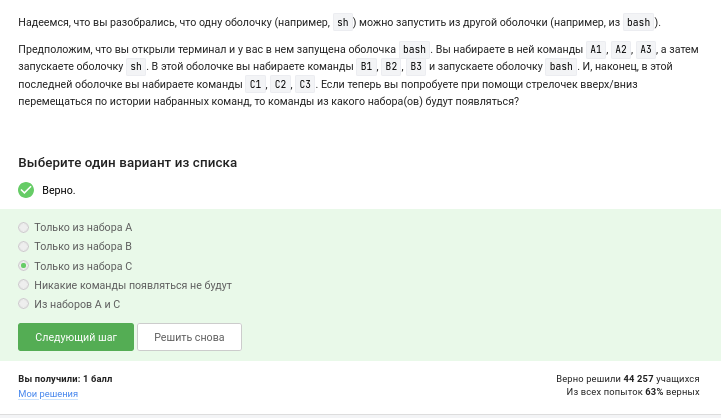{#fig-007 width=70%}

Пояснение: При использовании стрелок вверх/вниз в последней оболочке bash будут показаны команды C1, C2, C3, так как история команд ведётся для каждого экземпляра оболочки отдельно.

## 2.2. Вы можете скачать и изучить скрипты, которые мы показали в видеофрагменте: script1.sh, script2.sh.

Предположим, что вы находитесь в директории /home/bi/Documents/ и запускаете в ней скрипт следующего содержания:

#!/bin/bash

cd /home/bi/
touch file1.txt
cd /home/bi/Desktop/

Как будет выглядеть абсолютный путь до созданного файла file1.txt по окончанию работы скрипта?

([рис. @fig-008]).

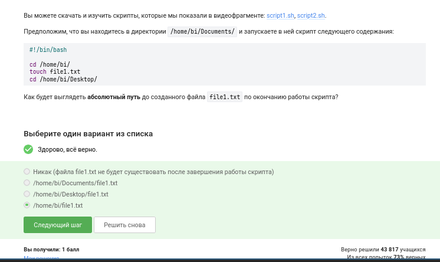{#fig-008 width=70%}

Пояснение: Скрипт переходит в /home/bi/ и создаёт там file1.txt, затем переходит на Desktop. Абсолютный путь: /home/bi/file1.txt.

## 2.3. Вы можете скачать и изучить скрипты, которые мы показали в видеофрагменте: variables1.sh, variables2.sh.

Какие из представленных ниже строк могут быть именами переменных в bash? Выберите все подходящие варианты!

([рис. @fig-009]).

{#fig-009 width=70%}

Пояснение: Имена переменных в bash могут содержать буквы, цифры и подчёркивания, но не могут начинаться с цифры. Например, _var, var1, VAR_NAME — допустимы; 1var, var-name — нет.

## 2.4. Вы можете скачать и изучить скрипт, который мы показали в видеофрагменте: arguments.sh.

Напишите скрипт на bash, который принимает на вход два аргумента и выводит на экран строку следующего вида:

Arguments are: $1=первый_аргумент $2=второй_аргумент


Например, если ваш скрипт называется ./script.sh, то при запуске его ./script.sh one two на экране должно появиться:

Arguments are: $1=one $2=two

а при запуске ./script.sh three four будет:

Arguments are: $1=three $2=four

([рис. @fig-010]).

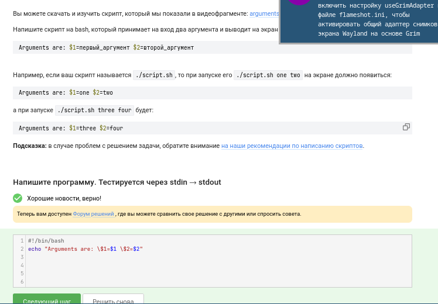{#fig-010 width=70%}

Пояснение: Скрипт выводит переданные аргументы:

```bash
#!/bin/bash
echo "Arguments are: \$1=$1 \$2=$2"
```

## 3.1. Вы можете скачать и изучить скрипт, который мы показали в видеофрагменте: branching1.sh.

Предположим, вы пишете скрипт на bash и хотите использовать в нем конструкцию if в следующем фрагменте:

if [[ ... ]]
then
  echo "True"
fi


Вы можете вписать вместо "..." (внутри [[ ]] и не забудьте про пробелы после [[ и перед ]]!) любое из перечисленных ниже условий. Однако мы просим вас выбрать только те из них, при которых echo напечатает на экран True вне зависимости от того, с какими параметрами был запущен ваш скрипт и какие в нем есть переменные.

Например, условие 0 -eq 0 подходит, т.к. ноль всегда равен нулю вне зависимости от аргументов и переменных внутри скрипта и на экран будет напечатано True.  В то же время условие $var1 -eq 0 не подходит, так как в переменной var1 как может быть записан ноль (тогда будет напечатано True), так его может и не быть (тогда ничего напечатано не будет).

([рис. @fig-011]).

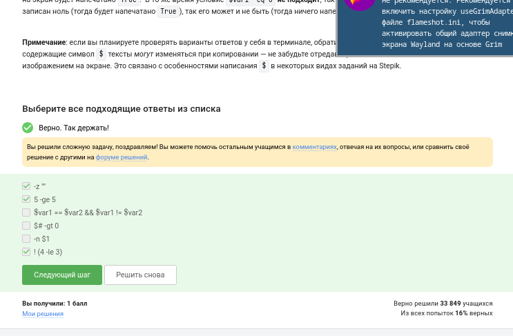{#fig-011 width=70%}

Пояснение: Условие, которое всегда истинно: 0 -eq 0 (ноль всегда равен нулю). Также -n "string" или -z "" всегда возвращают истину/ложь соответственно, независимо от переменных скрипта.

## 3.2. Вы можете скачать и изучить скрипты, которые мы показали в видеофрагменте: branching2.sh, branching3.sh.
 
Посмотрите на фрагмент bash-скрипта:

if [[ $var -gt 5 ]]
then
  echo "one" 
elif [[ $var -lt 3 ]]
then
  echo "two"
elif [[ $var -eq 4 ]]
then
  echo "three"
else
  echo "four"
fi

 

Какие строки и в какой последовательности он выведет на экран, если сначала этот скрипт запустили задав переменную var=3, а затем запустили еще раз, но уже с var=5.

([рис. @fig-012]).

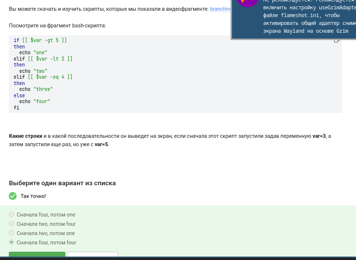{#fig-012 width=70%}

Пояснение: При var=3: первое условие $var -gt 5 ложно, второе $var -lt 3 ложно, третье $var -eq 4 ложно, срабатывает else → "four". При var=5: первое условие ложно, второе ложно, третье ложно, снова "four".

## 3.3. Напишите скрипт на bash, который принимает на вход один аргумент (целое число от 0 до бесконечности), который будет обозначать число студентов в аудитории. В зависимости от значения числа нужно вывести разные сообщения. 
Соответствие входа и выхода должно быть таким:

0 -->  No students
1 -->  1 student
2 -->  2 students
3 -->  3 students
4 -->  4 students
5 и больше --> A lot of students

([рис. @fig-013]).

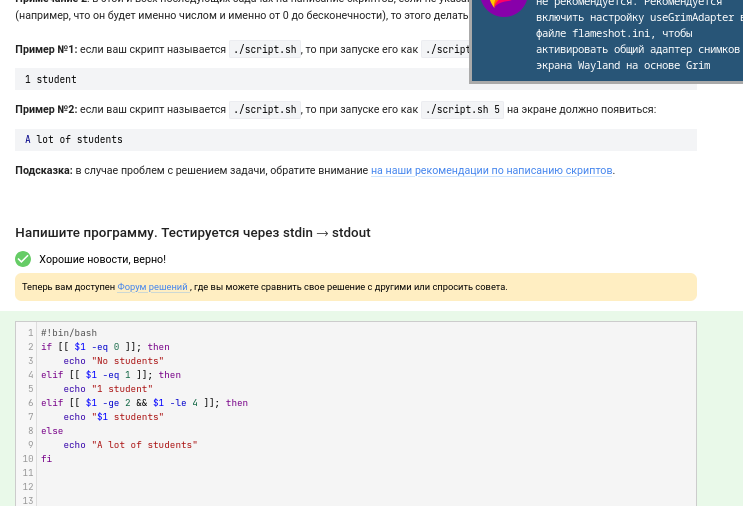{#fig-013 width=70%}

Пояснение: Скрипт использует case или if-elif-else для проверки числа студентов:

```bash
#!/bin/bash
if [ $1 -eq 0 ]; then echo "No students"
elif [ $1 -eq 1 ]; then echo "1 student"
elif [ $1 -le 4 ]; then echo "$1 students"
else echo "A lot of students"
fi
```

## 3.4. Вы можете скачать и изучить скрипты, которые мы показали в видеофрагменте: loops1.sh, loops2.sh.
 
Посмотрите на фрагмент bash-скрипта:

for str in a , b , c_d
do
  echo "start"  
  if [[ $str > "c" ]]
  then
    continue
  fi
  echo "finish"
done

Если запустить этот скрипт, то сколько раз на экран будет выведено слово "start", а сколько раз слово "finish"?

([рис. @fig-014]).

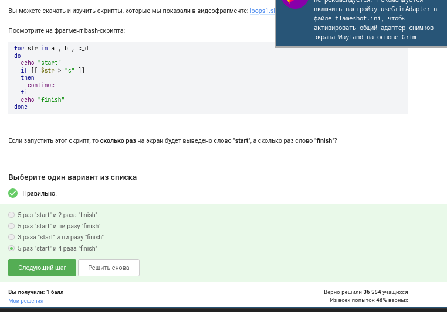{#fig-014 width=70%}

Пояснение: Цикл перебирает "a", "b", "c_d". Условие $str > "c" — лексикографическое сравнение. "a" и "b" меньше "c", continue не выполняется, выводятся "start" и "finish". "c_d" > "c", поэтому после "start" выполняется continue, "finish" не выводится. Итого: "start" — 3 раза, "finish" — 2 раза.

## 3.5. Напишите скрипт на bash, который будет определять в какую возрастную группу попадают пользователи. При запуске скрипт должен вывести сообщение "enter your name:" и ждать от пользователя ввода имени (используйте read, чтобы прочитать его). Когда имя введено, то скрипт должен написать "enter your age:" и ждать ввода возраста (опять нужен read). Когда возраст введен, скрипт пишет на экран "<Имя>, your group is <группа>", где <группа> определяется на основе возраста по следующим правилам:

    младше либо равно 16: "child",
    от 17 до 25 (включительно): "youth",
    старше 25: "adult".

После этого скрипт опять выводит сообщение "enter your name:" и всё начинается по новой (бесконечный цикл!). Если в какой-то момент работы скрипта будет введено пустое имя или возраст 0, то скрипт должен написать на экран "bye" и закончить свою работу (выход из цикла!).

([рис. @fig-015]).

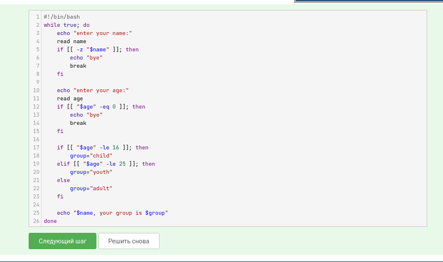{#fig-015 width=70%}

Пояснение: Скрипт реализует бесконечный цикл, запрашивает имя и возраст, проверяет на пустоту или возраст 0, затем определяет группу:

```bash
#/bin/bash
while true; do
  echo "enter your name:"
  read name
  if [ -z "$name" ]; then echo "bye"; break; fi
  echo "enter your age:"
  read age
  if [ "$age" -eq 0 ] || [ -z "$age" ]; then echo "bye"; break; fi
  if [ $age -le 16 ]; then group="child"
  elif [ $age -le 25 ]; then group="youth"
  else group="adult"
  fi
  echo "$name, your group is $group"
done
```

## 4.1. Вы можете скачать и изучить скрипты, которые мы показали в видеофрагменте: math1.sh, math2.sh.

Какие(ая) из предложенных ниже инструкций увеличат значение переменной а на значение переменной b? Например, если в а было записано 10, в b было 5, то в а должно записаться 15. 
Выберите все подходящие варианты!

([рис. @fig-016]).

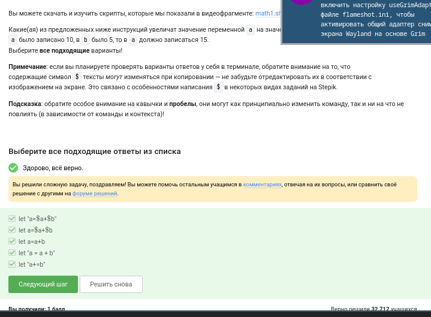{#fig-016 width=70%}

Пояснение: Увеличить a на b можно так: a=$((a+b)), let a+=b, a=$(($a+$b)). Варианты типа a=$a+$b без арифметического расширения просто конкатенируют строки.

## 4.2. Вы можете скачать и изучить скрипт, который мы показали в видеофрагменте: programs.sh.

Пусть вы находитесь в директории /home/bi/Documents/ и запускаете в ней скрипт следующего содержания:

#!/bin/bash

cd /home/bi/
echo "`pwd`"

Что в этом случае выведет команда echo на экран?

([рис. @fig-017]).

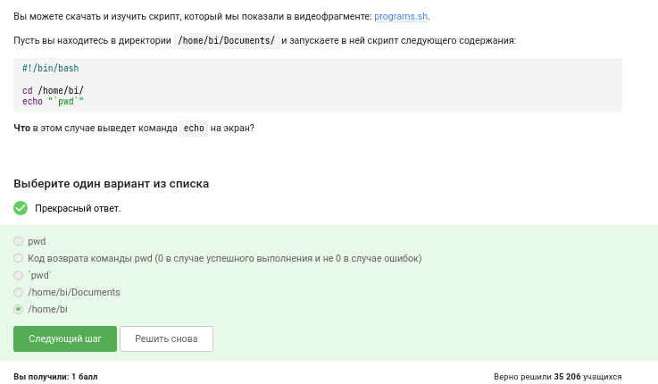{#fig-017 width=70%}

Пояснение: Команда echo "pwd" выведет строку pwd, а не результат выполнения команды pwd.

## 4.3. Мы рассказали, что можно проверить код возврата внешней программы прямо в конструкции if при помощи if `program options arguments` (действия внутри if выполнятся, если программа закончилась с кодом 0). Однако это не всегда правда! Если запуск внешней программы выводит что-то в stdout, то в проверку if поступит именно этот вывод, а не код возврата! Вы можете убедиться в этом, написав простой bash-скрипт с использованием, например, if `pwd`.

Однако как быть, если хочется всё-таки запустить программу program, которая пишет что-то в stdout и потом выполнить какие-то действия если ее код возврата равен 0? Выберите все верные утверждения или правильно работающие конструкции if.

([рис. @fig-018]).

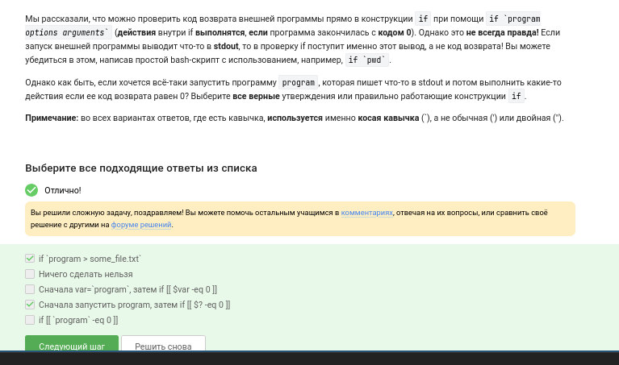{#fig-018 width=70%}

Пояснение: Для проверки кода возврата программы, выводящей что-то в stdout, нужно использовать if program args > /dev/null; then ... или if program args &> /dev/null; then .... Также можно проверить $? явно: program args; if [ $? -eq 0 ]; then ....

## 4.4. Вы можете скачать и изучить скрипты, которые мы показали в видеофрагменте: functions1.sh, functions2.sh.

Посмотрите на функцию из bash-скрипта:

counter ()  # takes one argument
{
  local let "c1+=$1"
  let "c2+=${1}*2"
} 

Впишите в форму ниже строку, которую выведет на экран команда echo "counters are $c1 and $c2" если она находится в скрипте после десяти вызовов функции counter с параметрами сначала 1, затем 2, затем 3 и т.д., последний вызов с параметром 10.

([рис. @fig-019]).

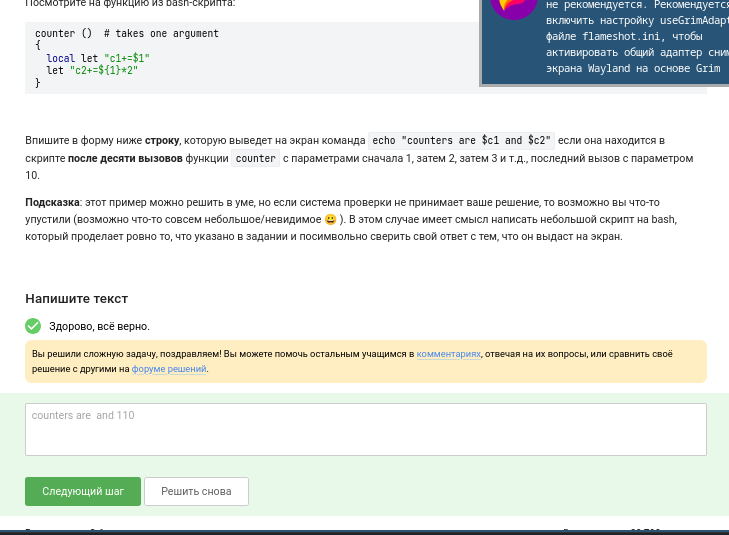{#fig-019 width=70%}

Пояснение: В функции используется local и let. Анализируем 10 вызовов:

· let "c1+=1" увеличивает c1 на 1 каждый вызов → c1 = 10.
· let "c2+={1}*2" — ошибка синтаксиса (правильно ${1}). Если исправить, то c2 = 2*(1+2+...+10) = 110.
  Строка вывода: counters are  and 110.

## 4.5. Напишите скрипт на bash, который будет искать наибольший общий делитель (НОД, greatest common divisor, GCD) двух чисел. При запуске ваш скрипт не должен ничего писать на экран, а просто ждет ввода двух натуральных чисел через пробел (для этого можно использовать read и указать ему две переменные -- см. пример в видеофрагменте). После ввода чисел скрипт считает их НОД и выводит на экран сообщение "GCD is <посчитанное значение>", например, для чисел 15 и 25 это будет "GCD is 5". После этого скрипт опять входит в режим ожидания двух натуральных чисел. Если в какой-то момент работы пользователь ввел вместо этого пустую строку, то нужно написать на экран "bye" и закончить свою работу. 

Вычисление НОД несложно реализовать с помощью алгоритма Евклида. Вам нужно написать функцию gcd, которая принимает на вход два аргумента (назовем их M и N). Если аргументы равны, то мы нашли НОД -- он равен M (или N), нужно выводить соответствующее сообщение на экран (см. выше). Иначе нужно сравнить аргументы между собой. Если M больше N, то запускаем ту же функцию gcd, но в качестве первого аргумента передаем (M-N), а в качестве второго N. Если же наоборот, M меньше N, то запускаем функцию gcd с первым аргументом M, а вторым (N-M).
Пример корректной работы скрипта:

./script.sh
10 15
GCD is 5
7 3 
GCD is 1

bye

([рис. @fig-020]).

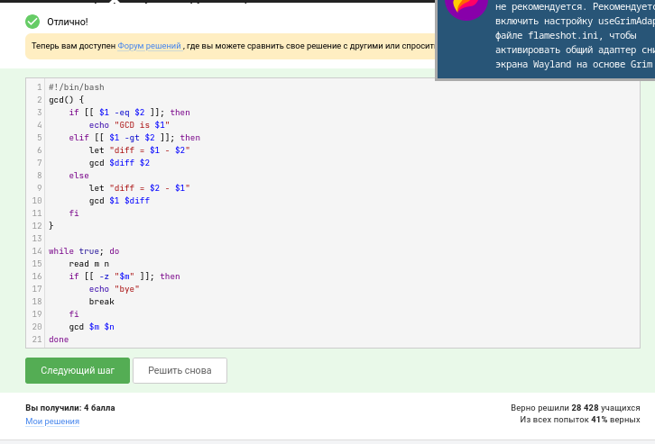{#fig-020 width=70%}

Пояснение: Алгоритм Евклида с рекурсивной функцией:

```bash
#!/bin/bash
gcd() {
  if [ $1 -eq $2 ]; then echo "GCD is $1"
  elif [ $1 -gt $2 ]; then gcd $(($1-$2)) $2
  else gcd $1 $(($2-$1))
  fi
}
while true; do
  read -p "" m n
  if [ -z "$m" ]; then echo "bye"; break; fi
  gcd $m $n
done
```

## 4.6. Напишите калькулятор на bash. При запуске ваш скрипт должен ожидать ввода пользователем команды (при этом на экран выводить ничего не нужно). Команды могут быть трех типов: 

    Слово "exit". В этом случае скрипт должен вывести на экран слово "bye" и завершить работу. 
    Три аргумента через пробел -- первый операнд (целое число), операция (одна из "+", "-", "*", "/", "%", "**") и второй операнд (целое число). В этом случае нужно произвести указанную операцию над заданными числами и вывести результат на экран. После этого переходим в режим ожидания новой команды.
    Любая другая команда из одного аргумента или из трех аргументов, но с операцией не из списка. В этом случае нужно вывести на экран слово "error" и завершить работу.
    
([рис. @fig-021]).

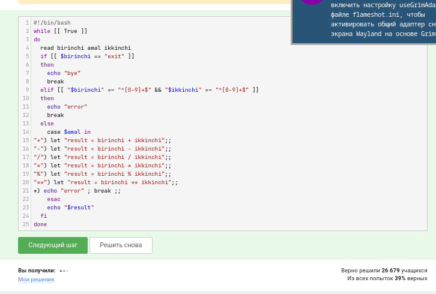{#fig-021 width=70%}

Пояснение: Калькулятор обрабатывает операции +, -, *, /, %, **. При вводе "exit" выводит "bye" и завершается. Неизвестные операции или неверное количество аргументов выводят "error". Используется арифметическое расширение $((...)).

## 5.1. Пусть в директории /home/bi лежат файлы Star_Wars.avi, star_trek_OST.mp3, STARS.txt, stardust.mpeg, Eddard_Stark_biography.txt.

Отметьте все файлы, которые найдет команда find /home/bi -iname "star*", но НЕ найдет команда find /home/bi -name "star*"?

([рис. @fig-022]).

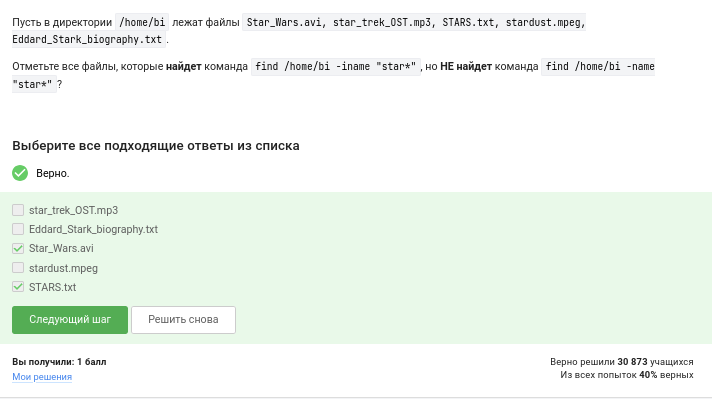{#fig-022 width=70%}

Пояснение: find -iname "star*" найдёт файлы без учёта регистра: Star_Wars.avi, star_trek_OST.mp3, STARS.txt, stardust.mpeg. find -name "star*" — только с маленькой буквы: star_trek_OST.mp3, stardust.mpeg. Разница: файлы, которые найдёт -iname, но не найдёт -name — начинающиеся с заглавных.

## 5.2. Задание на понимание работы опций -path и -name команды find. Отметьте все верные утверждения из перечисленных ниже.

([рис. @fig-023]).

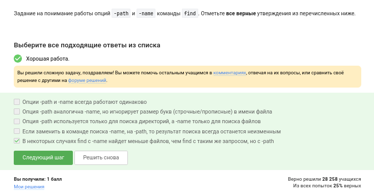{#fig-023 width=70%}

Пояснение: -name ищет только по имени файла, а -path — с учётом пути целиком. Опции влияют на то, что именно сопоставляется с шаблоном.

## 5.3. Предположим, что в директории /home/bi/ есть следующая структура файлов и поддиректорий:

/home/bi/
└── dir1
    ├── file1 
    └── dir2
        ├── file2
        └── dir3
            └── file3

Какие(ой) из трех файлов (file1, file2, file3) будут найдены по команде find /home/bi -mindepth 2 -maxdepth 3 -name "file*"?

([рис. @fig-024]).

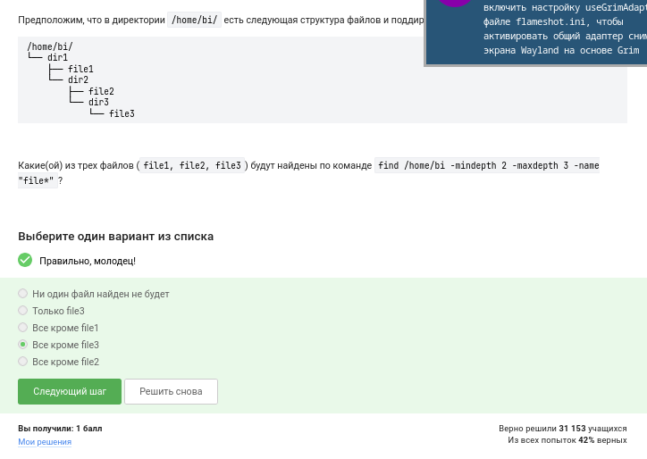{#fig-024 width=70%}

Пояснение: -mindepth 2 пропускает директорию /home/bi/ (глубина 0) и файлы на глубине 1. -maxdepth 3 ограничивает поиск глубиной 3. Будут найдены файлы на глубине 2-3, соответствующие шаблону file*.

## 5.4. Задание на понимание работы опций -A, -B и -C команды grep. Пусть у вас есть файл file.txt из 10 строк, причем в каждой строке есть слово "word". Если вы выполните на этом файле команды:

grep "word" file.txt > results.txt
grep -A 1 "word" file.txt > results.txt
grep -B 1 "word" file.txt > results.txt
grep -C 1 "word" file.txt > results.txt

то какая(ие) из них создаст файл results.txt наибольшего размера?

([рис. @fig-025]).

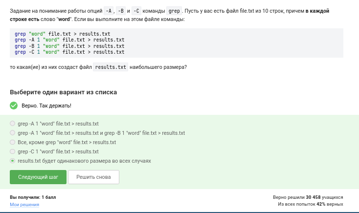{#fig-025 width=70%}

Пояснение: -C 1 выводит по одной строке контекста до и после, то есть 3 строки на каждое совпадение → максимальный размер results.txt.

## 5.5. Предположим, что в файле  text.txt записаны строки, показанные среди вариантов ответа. Отметьте только те из них, которые выведет на экран команда  grep -E "[xklXKL]?[uU]buntu$" text.txt.

([рис. @fig-026]).

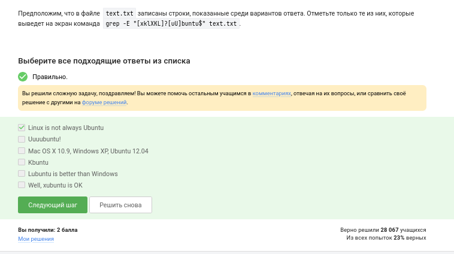{#fig-026 width=70%}

Пояснение: Регулярное выражение [xkIXKL]?[uU]buntu$ ищет строки, заканчивающиеся на "ubuntu" с возможным префиксом из одного символа из набора. Подходят: "Ubuntu", "ubuntu", "Xubuntu", "Kubuntu", "Lubuntu".

## 5.6. Что произойдет, если в команде sed -n "/[a-z]*/p" text.txt не указывать опцию -n?

([рис. @fig-027]).

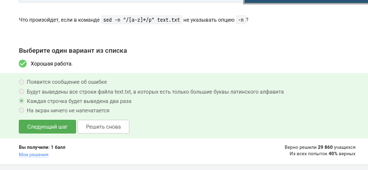{#fig-027 width=70%}

Пояснение: Без опции -n sed по умолчанию выводит все строки, а с командой /p — ещё и дублирует совпавшие. Таким образом, совпавшие строки будут выведены дважды.

## 5.7. Запишите в форму ниже инструкцию sed, которая заменит все "аббревиатуры" в файле input.txt на слово "abbreviation" и запишет результат в файл edited.txt (на экран при этом ничего выводить не нужно). Обратите внимание, что в инструкции должны быть указаны и сам sed, и оба файла!

Под "аббревиатурой" будем понимать слово, которое удовлетворяет следующим условиям: 

    состоит только из больших букв латинского алфавита,
    состоит из хотя бы двух букв,
    окружено одним пробелом с каждой стороны.

При этом будем считать, что в тексте не может быть две "аббревиатуры" подряд. Например, текст  " YOU YOU and YOU!" является некорректным (в нем есть две "аббревиатуры", но они идут подряд) и на таких примерах мы проверять вашу инструкцию не будем.
 
 
Пример: если у вас был текст "Hi, I heard these songs by ABBA, TLA and DM !", то он должен быть преобразован в "Hi, I heard these songs by ABBA, abbreviation and abbreviation !".

([рис. @fig-028]).

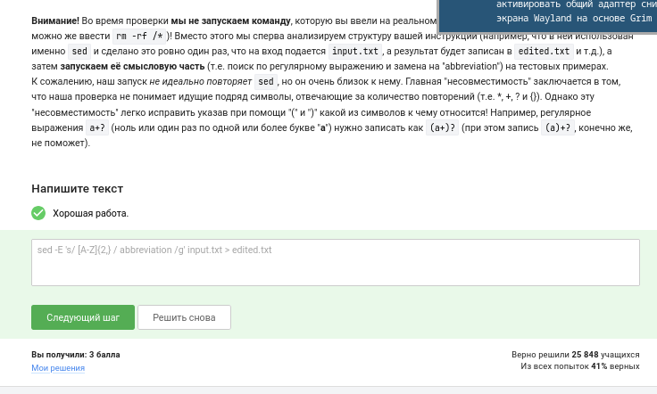{#fig-028 width=70%}

Пояснение: sed команда для замены «аббревиатур»:

```bash
sed -E 's/ [A-Z]{2,} / abbreviation /g' input.txt > edited.txt
```
 
## 6.1. Вы можете скачать и попробовать применить gnuplot к файлу, который мы показали в видеофрагменте: authors.txt.

Какую опцию нужно указать при запуске gnuplot, чтобы при его закрытии не были автоматически закрыты и все нарисованные в нём графики?

([рис. @fig-029]).

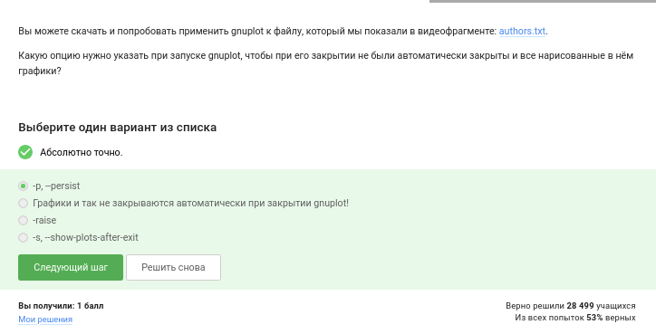{#fig-029 width=70%}

Пояснение: gnuplot строит графики по данным из файла. Команда plot "authors.txt" выведет точки или линии в зависимости от настроек и формата файла.

## 6.2. Предположим у вас есть файл data.csv с двумя столбцами по 10 чисел в каждом. В первой строке не записаны названия столбцов, т.е. ряды данных начинаются прямо с первой строки. Вы запускаете gnuplot и вводите в него две команды:

set key autotitle columnhead
plot 'data.csv' using 1:2

Какое в этом случае будет название у построенного ряда данных и сколько будет нарисовано точек на графике?

([рис. @fig-030]).

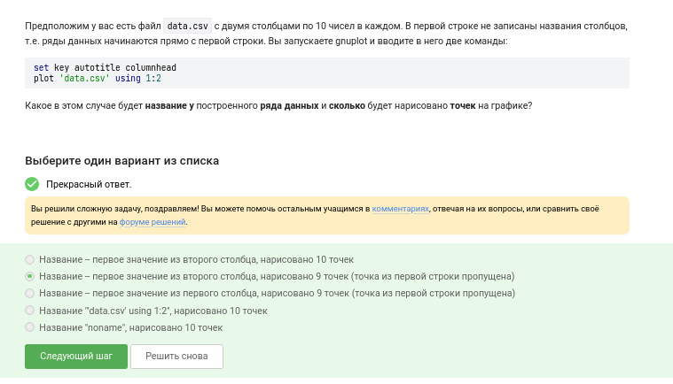{#fig-030 width=70%}

Пояснение: При set key autotitle columnhead gnuplot ожидает заголовки столбцов в первой строке. Если их нет, название ряда может быть пустым, а количество точек — 10 (по числу строк с данными).

## 6.3. Вы можете скачать и изучить скрипты, которые мы показали в видеофрагменте: plot.gnu, plot_advanced.gnu, plot_advanced2.gnu. Все три скрипта основаны на этой заметке, данные также взяты оттуда.

Предположим, что вы пишите gnuplot-скрипт и у вас в нем есть три переменные x1, x2, x3, в которых записаны координаты важных точек по оси ОХ (по возрастанию). Вы хотите, чтобы на этой оси было только три деления (т.е. три черточки) в этих самых координатах, а подписи этих делений были оформлены в виде "point <номер точки>, value <значение соответствующей переменной>".
Например, для x1=0, x2=10, x3=20, это были бы надписи "point 1, value 0" в точке с координатой 0 по горизонтали,  "point 2, value 10" в точке с координатой 10 и  "point 3, value 20" в точке с координатой 20.
Или, например,  x1=100, x2=150, x3=250, это были бы надписи "point 1, value 100" в точке с координатой 100, "point 2, value 150" в точке с координатой 150 и "point 3, value 250" в точке с координатой 250. 

Впишите в форму ниже одну команду (т.е. одну строку), которую нужно добавить в скрипт, для выполнения этой задачи.

([рис. @fig-031]).

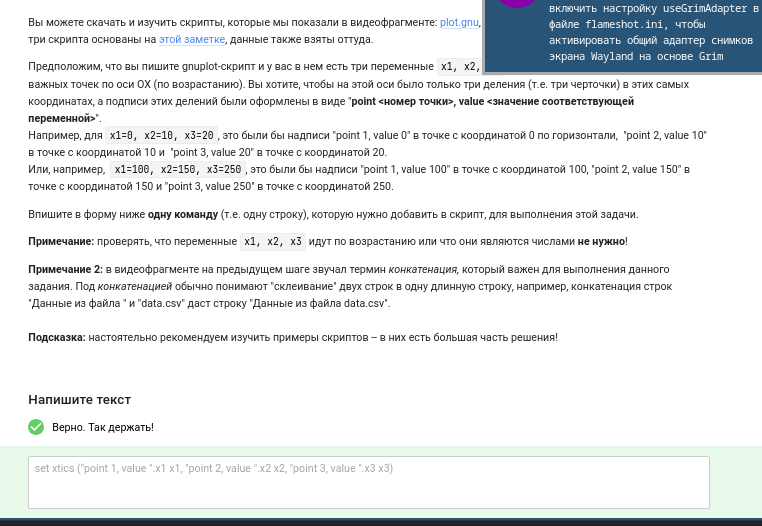{#fig-031 width=70%}

Пояснение: Команда для установки пользовательских делений:

```
set xtics ("point 1, value 0" 0, "point 2, value 10" 10, "point 3, value 20" 20)
```

## 6.4. Если вы не скачали на предыдущем шаге файлы animated.gnu и move.rot, то скачайте их теперь, т.к. они понадобятся для выполнения задания. 

Указанные файлы использовались в последнем видеофрагменте для создания вращающегося графика. Измените инструкции в файле move.rot (т.е. добавлять и удалять инструкции нельзя!) таким образом, чтобы:

    График отразился зеркально относительно горизонтальной поверхности. То есть там, где была точка (10, 10, 200), станет точка (10, 10, -200), где была точка  (-10, -10, 200) станет (-10, -10, -200) и т.д. При этом точка (0, 0, 0) останется на месте.
    Изображение стало вращаться в обратную сторону. То есть если раньше вращалось "влево", то теперь станет "вправо".
    Вращение стало в два раза быстрее. То есть станет в два раза больше перерисовок графика на каждую секунду вращения.

Измененный файл загрузите в форму ниже.

([рис. @fig-032]).

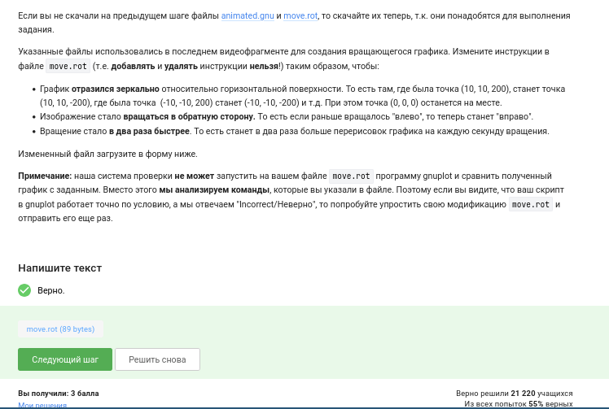{#fig-032 width=70%}

Пояснение: В файле move.rot нужно изменить значения координат и скорости вращения: инвертировать координату Z, изменить направление и увеличить частоту кадров.

## 7.1. Какая команда(ы) установят файлу file.txt права доступа rwxrw-r--, если изначально у него были права r--r--r--. Укажите все верные варианты ответа!

([рис. @fig-033]).

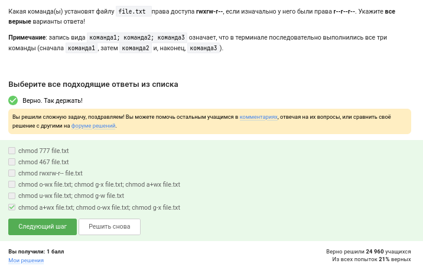{#fig-033 width=70%}

Пояснение: Команды для установки прав rwxrw-r-- из r--r--r--:

```
chmod 764 file.txt
```

Или символьная форма:

```
chmod u+rwx,g+rw,o+r file.txt
```

## 7.2. Предположим вы использовали команду sudo для создания директории dir. По умолчанию для dir были выставлены права доступа rwxr-xr-x (владелец root, группа root). Таким образом никто кроме пользователя root не может ничего записывать в эту директорию, например, не может создавать файлы в ней. 

После выполнения какой команды user из группы group всё-таки сможет создать файл внутри dir? Укажите все верные варианты ответов!

([рис. @fig-034]).

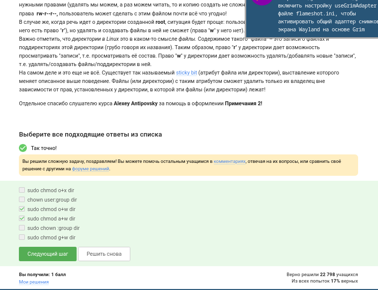{#fig-034 width=70%}

Пояснение: Чтобы пользователь из группы мог создавать файлы в директории dir, нужно либо сменить владельца/группу (chown user:group dir), либо добавить права на запись для группы (chmod g+w dir).

## 7.3. Отметьте какие характеристики файла можно посчитать с использованием команды wc.

([рис. @fig-035]).

{#fig-035 width=70%}

Пояснение: wc считает строки (опция -l), слова (-w), байты/символы (-c/-m).

## 7.4. Впишите в форму ниже команду, которая выведет сколько места на диске занимает текущая директория (при этом размер нужно вывести в удобном для чтения формате (например, вместо 2048 байт надо выводить 2.0К) и больше на экран выводить ничего не нужно). В команде указывайте только необходимые для выполнения задания опции и аргументы, лишних опций указывать не нужно!

([рис. @fig-036]).

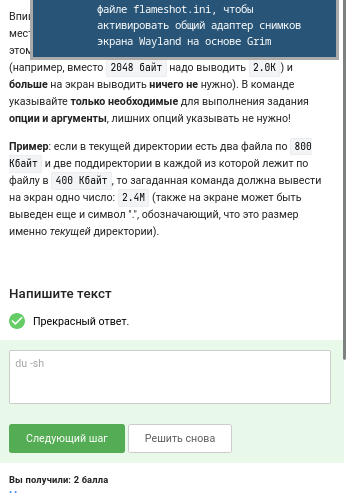{#fig-036 width=70%}

Пояснение: Команда du -sh выводит размер текущей директории в человекочитаемом формате (например, 2.4M), не показывая размеры поддиректорий по отдельности (опция -s).

## 7.5. Впишите в форму ниже максимально короткую команду (т.е. в которой минимально возможное число символов), которая позволит создать в текущей директории 3 поддиректории с именами dir1, dir2, dir3.

([рис. @fig-037]).

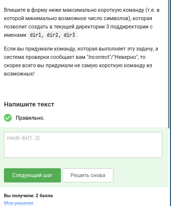{#fig-037 width=70%}

Пояснение: Самая короткая команда для создания трёх директорий:

```
mkdir dir{1,2,3}
```

Это разворачивается shell в mkdir dir1 dir2 dir3.

# Выводы

Я изучила продвинутые темы.

